- [机器人导航案例](#机器人导航案例)
- [Kuavo 上位机导航程序编译手册](#kuavo-上位机导航程序编译手册)
  - [程序编译](#程序编译)
    - [1、获取代码](#1获取代码)
    - [2、导航功能包编译](#2导航功能包编译)
    - [3、添加source环境变量](#3添加source环境变量)
- [Kuavo 上位机导航GUI界面使用手册](#kuavo-上位机导航gui界面使用手册)
  - [GUI界面](#gui界面)
    - [1、程序启动](#1程序启动)
    - [2、GUI界面简介](#2gui界面简介)
    - [3、机器人系统信息显示模块](#3机器人系统信息显示模块)
    - [4、地图管理模块](#4地图管理模块)
      - [4.1 建图指令](#41-建图指令)
      - [4.2 当前地图名称](#42-当前地图名称)
      - [4.3 地图切换](#43-地图切换)
      - [4.4 地图删除](#44-地图删除)
    - [5、任务管理模块](#5任务管理模块)
      - [5.1 任务执行控制](#51-任务执行控制)
      - [5.2 当前任务状态](#52-当前任务状态)
      - [5.3 机器人基本信息](#53-机器人基本信息)
- [Kuavo 上位机导航程序建图与导航使用手册](#kuavo-上位机导航程序建图与导航使用手册)
  - [一、建图](#一建图)
    - [1、程序启动](#1程序启动-1)
    - [2、建图步骤](#2建图步骤)
    - [3、路径与路径点设置步骤](#3路径与路径点设置步骤)
      - [(1) 路径点设置](#1-路径点设置)
        - [界面操作](#界面操作)
        - [使用代码操作](#使用代码操作)
      - [(2) 路径设置](#2-路径设置)
        - [界面操作](#界面操作-1)
        - [代码操作](#代码操作)
    - [4、任务点设置步骤](#4任务点设置步骤)
        - [界面操作](#界面操作-2)
        - [代码操作](#代码操作-1)
  - [二、导航](#二导航)
    - [RVIZ 界面导航](#rviz-界面导航)
    - [任务点导航](#任务点导航)
      - [界面操作](#界面操作-3)
      - [代码操作](#代码操作-2)


# 机器人导航案例
- 机器人导航案例包括功能有：雷达slam建图、路线规划、定位与导航、停障


# Kuavo 上位机导航程序编译手册
## 程序编译

### 1、获取代码

```bash
git clone https://www.lejuhub.com/ros-application-team/kuavo_ros_navigation.git 
或 
git clone ssh://git@www.lejuhub.com:10026/ros-application-team/kuavo_ros_navigation.git
```

### 2、导航功能包编译

* **注：若非第一次编译，需删使用命令 `sudo rm -rf build devel` 除编译文件**

* 使用以下命令编译即可

```bash
cd ~/kuavo_ros_navigation/
catkin_make
```

### 3、添加source环境变量

* **注：若~/.bashrc中已有该部分环境变量，可不用执行下述操作**

```bash
echo "# kuavo_ros_navigation 
source ~/kuavo_ros_navigation/devel/setup.bash --extend" >> ~/.bashrc

```

# Kuavo 上位机导航GUI界面使用手册

## GUI界面

### 1、程序启动

```bash
roslaunch dx_chassis_manager dx_chassis_manager.launch
```
```bash
roslaunch nav_gui nav_gui.launch 
```

### 2、GUI界面简介

* 程序启动以后出现以下界面\
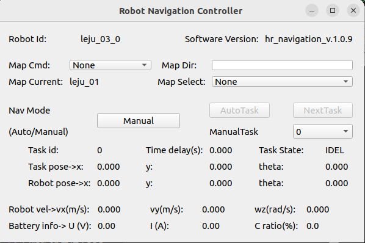

* 定位导航 GUI 界面是基于《定位导航系统 API 定义》里的 API 接口，开发的一款集地图管理、任务管理和图片保存功能的 GUI 界面，目的是方便快速测试机器人的功能，省去命令终端手敲命令行的烦恼。\
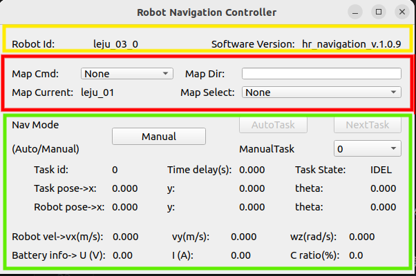
* 其中导航 GUI 界面整体布局：黄色为机器人系统信息显示模块，红色为地图管理模块，绿色为任务管理模块

### 3、机器人系统信息显示模块

* 该部分连接机器人信息，显示机器人的ID以及机器人导航系统的版本号\
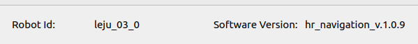

### 4、地图管理模块

* 该部分为地图管理模块，主要功能有：建图指令、地图保存指令、设置机器人当前地图等\
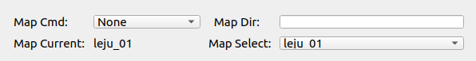

#### 4.1 建图指令
* 建图命令框，map cmd 中有以下类选项：\
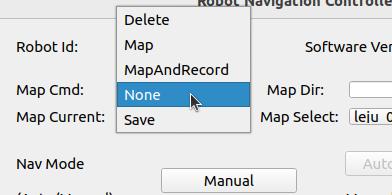

* 其中 
```bash
    --- None：无动作
    --- Map：新建地图
    ---MapAndRecord： 新建地图的同时记录 rosbag 包
    ---Save：保存新建的地图，然后自动切换为导航模式，并使用新建的地图
    ---Delete：删除地图
```
* 地图路径（地图名称）,该路径为地图的相对路径，地图基路径为 “/home/kuavo/maps” 
* 例：因此当地图名称为 “test” 时，机器人的地图绝对路径为 “/home/kuavo/maps/test” ，当地图名称缺省时，机器人地图绝对路径为“/home/drivex/maps”
* 建图之前，可以在 Map Dir 中输出此次建立地图的名称。例如我想要建立名为 lejurobot 的地图，可以在 Map Dir 中输入lejurobot\
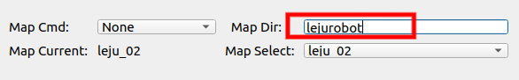
* 地图建立完成以后，在 map cmd 中，选择 Save 保存地图\
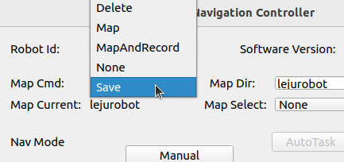

#### 4.2 当前地图名称
* 在Map Current 标签中，可以看到机器人当前使用的地图名称 map cmd 中\
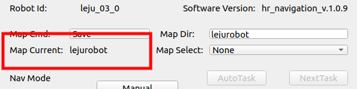

#### 4.3 地图切换
* “Map Select” 下拉列表里是机器人内存储的所有有效地图名称列表，点击并选择相应条目，即可实现地图的切换。\
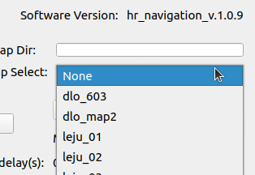

#### 4.4 地图删除
* 首先，”Map Dir”栏里输入要删除的地图名称，如“test”，然后，“Map Cmd”下拉列表里选择“Delete”指令，删除指定地图\
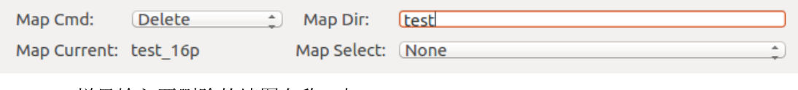
* 注意：为了防止定位程序出错，不允许删除当前使用的地图，也即“Map Current”栏显示的地图，否则会弹出警告信息，如果确实要删除该地图请先切换到其它地图，然后再重新执行删除

### 5、任务管理模块
* 任务管理模块主要由任务执行控制、当前任务状态显示和机器人基本信息三部分组成\
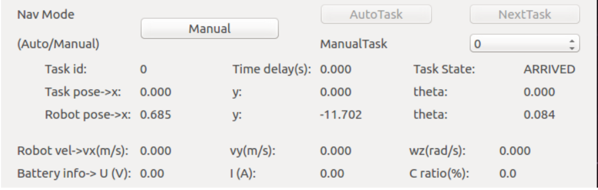

#### 5.1 任务执行控制
* 按钮“Manual/Auto”：模式切换手动/自动运行任务
* 按钮“AutoTask”：开始执行自动任务
* 按钮“NextTask”：强制开始下一个任务
* 下拉列表“ManualTask”：手动选择要执行的任务

#### 5.2 当前任务状态
* Task id – 当前正在执行任务的 id 号
* Time delay – 当前任务点到达之后的等待时间，单位：s，当 time delay 大于 0 时，机器人到达该目标点之后等待时间超过 time delay 之后就会自动执行下一个任务点，当 time delay 小于 0 时，机器人将一直等待直到其它节点下发下一个任务点。
* Task State: 执行当前任务点的状态如下：
    1、IDEL – 机器人未执行任何任务\
    2、FOLLOW – 机器人正在执行当前任务，且机器人离目标点较远\
    3、ARRVING – 机器人正在执行当前任务，且机器人离目标点较近，此时机器人会降速\
    4、ADJUSTDIRECTION – 机器人正在执行当前任务，机器人位置已经到达，正在调整航向角\
    5、ARRIVED – 机器人成功到达目标点，机器人停止，直至下一个任务下发\
    6、FAIL—机器人到达目标点失败，机器人停止，直至下一个任务下发

#### 5.3 机器人基本信息

* Robot vel-> 机器人实时速度信息：
    vx(m/s): 行驶线速度（前后），前向为正，单位:m/s\
    vy(m/s): 行驶角速度（左右），左向为正，单位:m/s\
    wz(rad/s): 行驶角速度，逆时针为正，单位: rad/s

# Kuavo 上位机导航程序建图与导航使用手册

## 一、建图

### 1、程序启动

* **启动导航程序之前确保程序已经编译，若未编译，参考[导航程序编译手册](导航程序编译手册.md)编译程序**

```bash
roslaunch dx_chassis_manager dx_chassis_manager.launch
```

```bash
roslaunch nav_gui nav_gui.launch
```

### 2、建图步骤

* 在GUI界面中，在 Map Dir 中添加本次建图的名称，然后将 Map Cmd 中切换为 Map ，之后打开 RVIZ ， 移动机器人进行建图

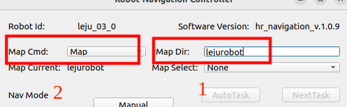

* RVIZ 建图界面

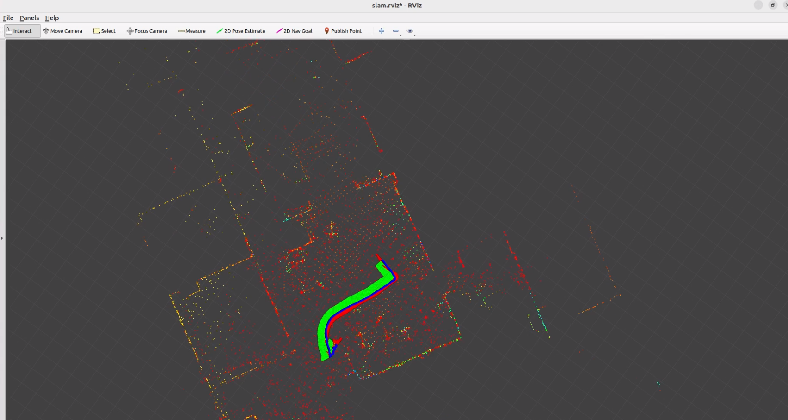

* 建图完成以后，在GUI界面 Map Cmd 中切换为 Save 保存地图

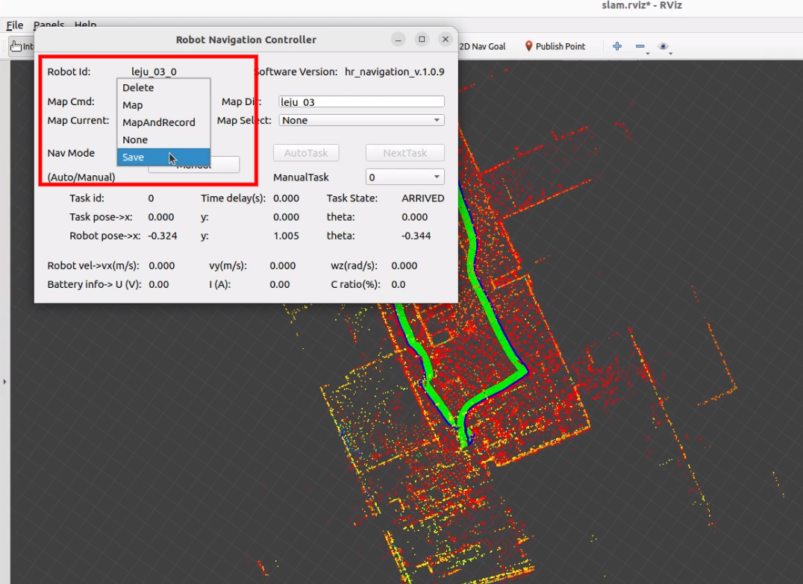

* 之后RVIZ界面效果如下图所示

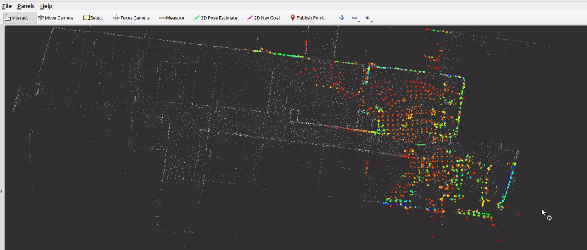

### 3、路径与路径点设置步骤

* 地图建立完成以后，需要编辑道路，即告诉机器人哪部分道路为可行使区域。同理我们现实的道路，城市与城市之间通过道路相连，这就是道路（路径），城市就是路径点。

* 导航采用基于道路的搜索方式，道路包含包含连通关系（节点之间的连通）、道路宽度、道路最大限速、通行状态（正常/禁止通行）。编辑道路主要分为两个步骤：节点编辑和道路属性编辑。道路、节点和任务点都可以进行增加和删除操作，当新增节点/道路/任务点 id 与旧的相同时会对旧的站点/道路/任务点进行覆盖。

#### (1) 路径点设置

* 路径点设置分为有两种操作方式：

##### 界面操作

* 在RVIZ界面左上角点击 panels -> add new panel -> Route 进入路径点编辑界面，其中红色部分为路径编辑，黄色部分为路径点编辑

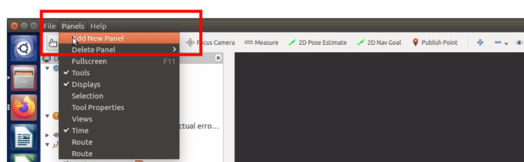

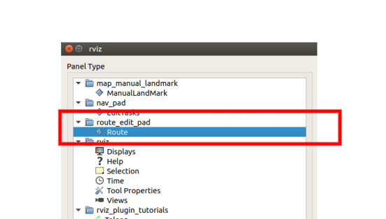

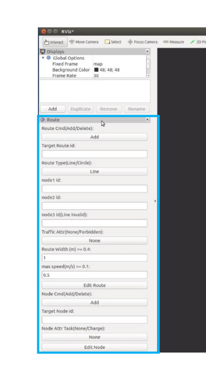

* 可以拖动“Route”插件到任意位置

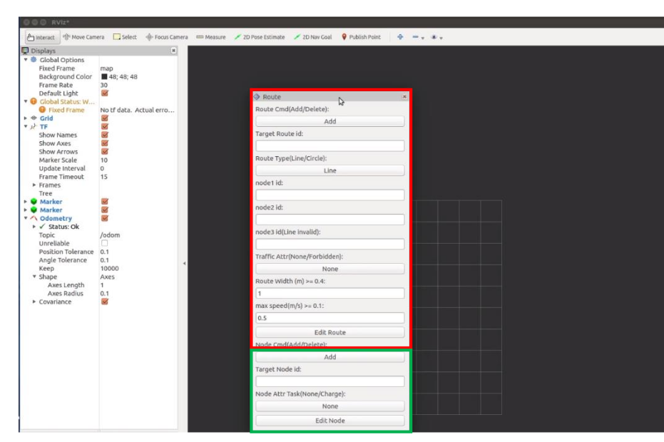

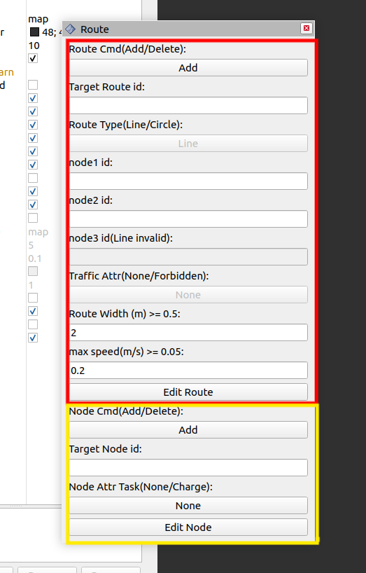

* 1、设置编辑命令，点击“Node Cmd（Add/Delete）”下方按钮，按钮显示会在“Add”和“Delete”之间切换，显示值即为当前命令状态；注意：当命令为“Add”时节点 ID 已存在时，会覆盖原来节点信息；

* 2、设置编辑的节点 ID，在“Target Node id:”下方输入框内输入节点 ID（>=0），当编辑完一个节点后，输入框内 ID 编号会自动+1，如果显示值与目标值一致则无需更改；

* 3、设置节点任务属性， 点击 “Node Attr Task（ None/Charge ）” 下方按钮 ，按钮显示会在“None“ 和“Charge”之间切换，同样显示值即为当前属性状态；

* 4、当设置完以上三项且确认机器人开到目标位姿后，点击“Edit Node”按钮，命令执行完后会弹出一条消息框，提示当前命令执行状态，阅读确认后请关闭消息框。

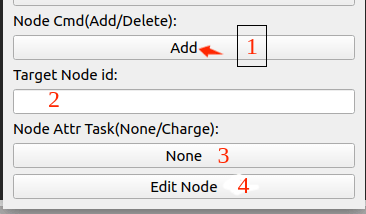

* 添加路径点示例

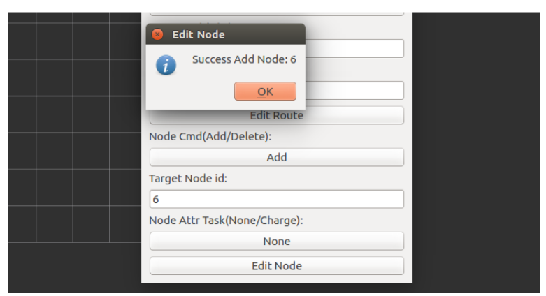

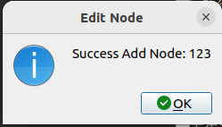

* 删除路径点示例

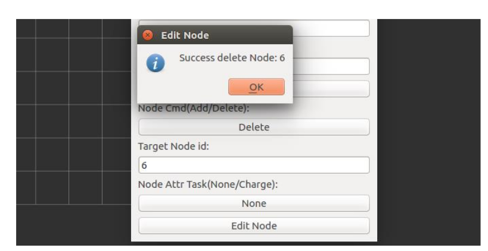

##### 使用代码操作

* 调用 /srv_edit_node 服务增加还是删除路径点

```bash
rosservice call /srv_edit_node "{cmd: '', id_node: 0, attr_task: '', x: 0.0, y: 0.0, theta: 0.0}"
```

* 增加或删除道路点使用说明，在 cmd 中输入 Add 或 Delete 选择此次是增加还是删除路径点，在 id_node 中输入此次操作的 id ，在 attr_task 部分可选择默认，在 x: 0.0, y: 0.0, theta: 0.0 中输入此次操作路径点的位置，以下是示例以及操作成功的提示（红色部分为路径点添加示例，黄色部分为添加成功示例）：

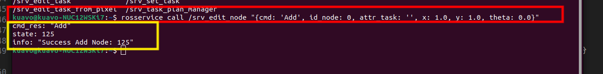

#### (2) 路径设置

* 路径点设置完成以后，需要将路径点相连形成道路（即机器人可行使区域）

##### 界面操作

* 1、设置编辑命令，点击“Route Cmd（Add/Delete）”下方按钮，按钮显示会在“Add”和“Delete”之间切换，显示值即为当前命令状态；注意：当命令为“Add”时道路 ID 已存在，则覆盖原来道路信息；

* 2、设置编辑道路 ID，点击“Target Route id:”下方输入框内输入想要编辑的道路 ID，当编辑完一个道路后，输入框内 ID 编号会自动+1，如果显示值与目标值一致则无需更改；

* 3、设置道路形状属性，点击“Route Type（ Line/Circle）:”下方按钮，按钮显示会在 “Line”和“Circle”之间切换，显示值即为当前属性；

* 4、输入组成道路的节点 ID，分别在“node1 id:”、“node2 id:”和“node3 id:”输入栏中输入相应 ID 值。注意：当命令为“Delete”时，此处设置无效，可以不填；当命令为“Add”，形状属性为“Line”时，1 和 2 分别为直线起点和终点 ID，3 可以缺省；当命令为“Add”，形状属性为“Circle”时，1 和 3 为圆弧起点和终点， 2 为圆弧上其它任意一点（建议选在圆弧中间附近）

* 5、设置编辑道路属性，点击“Traffic Attribute（None/Forbidden）”下方按钮，按钮显示值会在“None”和“Forbidden”之间切换，显示值即为当前属性值；

* 6、设置道路宽度，在“Route Width（m） >= 0.4:”下方输入框内输入道路宽度，单位：m，输入数值必须>=0.4（当数值小于 0.4 时会弹出错误提示框，请关闭提示框后输入有效值）；

* 7、设置道路上机器人最大速度，在“max speed(m/s) >= 0.1:”下方输入框内输入机器人在该道路段最大速度，单位：m/s，输入值必须>=0.1（当数值小于 0.1 时会弹出错误提示框，请关闭提示框后输入有效值）；

* 8、确认以上步骤的设置无误后，点击按钮“Edit Route”，命令执行完会弹出一条消息框，提示当前命令执行状态，阅读确认后请关闭消息框。

* 示例：增加道路 5：起点->1，终点->2，通行状态->正常，道路宽度->2.0m，最大速度->0.6m/s，则编辑框和消息提示框如图

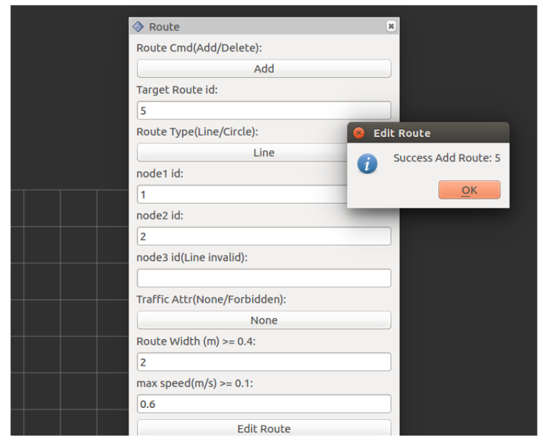

* 删除道路示例

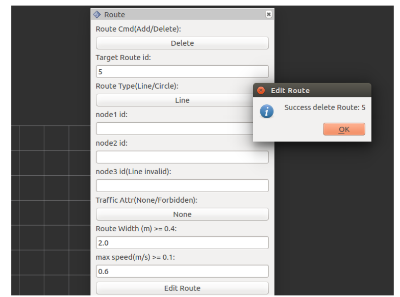

* 道路宽度说明：道路生成以后可以为其设置道路宽度。例如在道路点2与道路点3之间生成一条路径，可以为该路径设置宽度与最大速度，即在建立道路时在 Route Width 中设置道路宽度(可根据实际宽度设置)，在RVIZ中看到的蓝色线为道路中心线，道路宽度则在该中心线两边各平分一半，道路边界是虚拟的，不会显示出来。假设该道路宽度为2m,即在蓝色线两边各延伸1米。

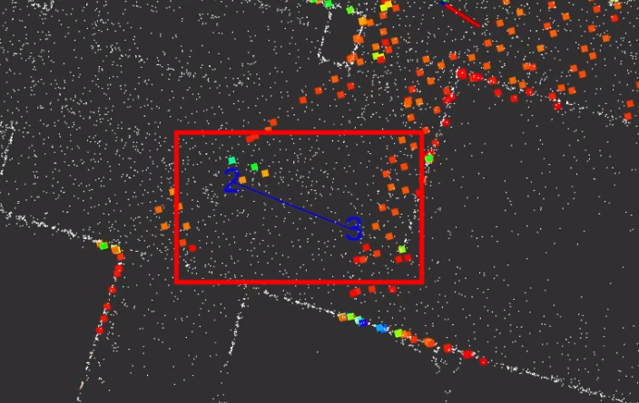

* 道路最大速度说明：道路生成以后可以为其设置最大速度，即限制当前道路机器人的速度。例如设置最大速度为 0.6m/s， 则导航时，机器人在该道路上的最大速度就不会操作 0.6m/s。

* 另外限制机器人的最大速度有两部分，第一部分为道路限速，第二部分为机器人配置文件(src/hr_nav_controller/00_contoller/dx_chassis_manager/cfg/leju_03/params_motion_control.yaml)限速，两则限速取最低。例如道路限速为 0.6m/s，机器人配置文件限速为 0.4m/s, 则在行使时的最大速度则为 0.4m/s，总之机器人的最终速度取决于两则最低速度。


##### 代码操作

* 调用 /srv_edit_route 服务增加还是删除路径

```bash
rosservice call /srv_edit_route "{cmd: '', id_route: 0, type_route: '', id_node1: 0, id_node2: 0, id_node3: 0, attr_traffic: '',
  width: 0.0, max_speed: 0.0}" 
```

* 增加或删除道路使用说明，在 cmd 中输入 Add 或 Delete 选择此次是增加还是删除路径，在 id_node1 与 id_node2 中输入此次操作的 id ,id_node3不输入任何值，在 attr_traffic 部分可选择默认，在 width 中输入当前路径的宽度，在 max_speed 中输入当前道路的最大速度，以下是示例以及操作成功的提示：

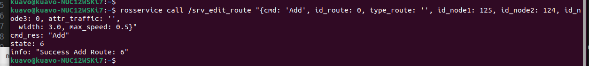

### 4、任务点设置步骤

* 可以通过设置任务点让机器人到达指定位置完成指定任务

##### 界面操作

* 在RVIZ界面左上角点击 panels -> add new panel -> EditTasks 然后点击右下方“OK”，在 Rviz 左侧列表中将出现“EditTasks”插件，如果需要挪动“EditTasks”插件位置，可以鼠标光标放置在插件上方灰色区域。单击鼠标左键拖动到任意位置。进入任务点编辑界面

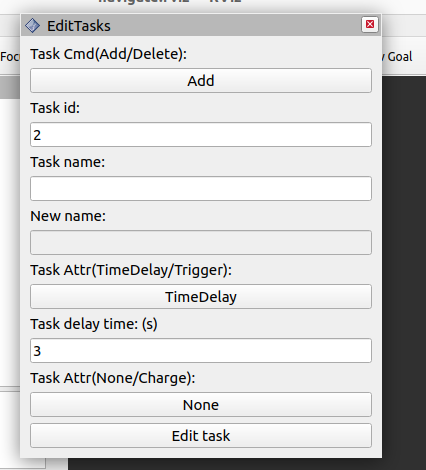

* 1、设置编辑命令，点击“Task Cmd（Add/Delete）”下方按钮，按钮显示会在“Add”和“Delete”之间切换，显示值即为当前命令状态；注意：当命令为“Add”时节点 ID 已存在时，会覆盖原来节点信息；

* 2、设置编辑的任务 ID，在“Task id:”下方输入框内输入节点 ID（>=0），当编辑完一个节点后，输入框内 ID 编号会自动+1，如果显示值与目标值一致则无需更改；

* 3、设置节点任务属性，点击“Task Attr（None/Charge）”下方按钮，按钮显示会在“None“ 和“Charge”之间切换，同样显示值即为当前属性状态；

* 4、当设置完 a.b.c 三项且确认机器人开到目标位姿后，点击“Edit Node”按钮，命令执行完后会弹出一条消息框，提示当前命令执行状态，阅读确认后请关闭消息框。

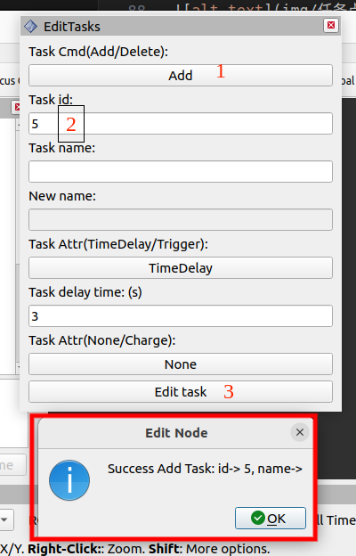

* 删除任务点与重命名任务点上述操作相似

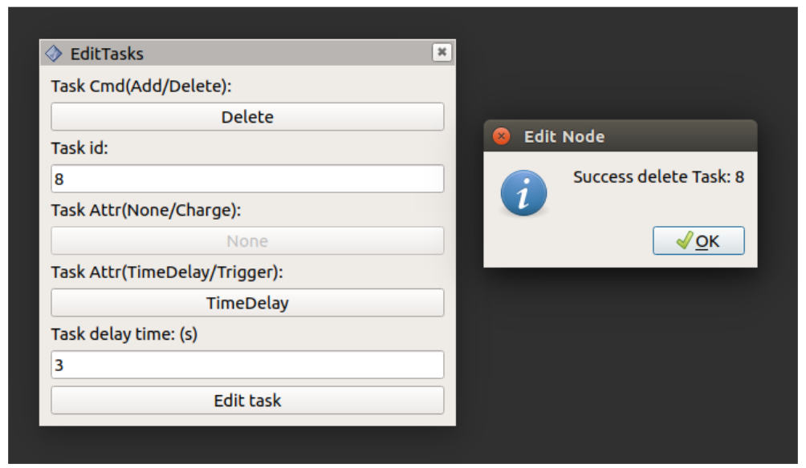

##### 代码操作

* 调用 /srv_edit_task 服务增加、删除、重命名任务点

```bash
rosservice call /srv_edit_task "{cmd: '', name_task: '', id_task: 0, attr_task: '', name_new: '', time_delay: 0.0,
  x: 0.0, y: 0.0, theta: 0.0}" 
```

* 增加或删除道路使用说明，在 cmd 中输入 Add 或 Delete 或在 ReName 选择此次是增加、删除还是重命名任务点，在 id_task 中输入此次操作的 id ,在 x: 0.0, y: 0.0, theta: 0.0 中输入任务点坐标，其他均可选择默认，以下是示例以及操作成功的提示：

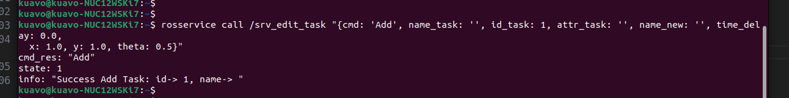

## 二、导航

* 注意：导航目标点和当前点必须在道路网范围内

### RVIZ 界面导航

* 在 RVIZ 界面中 使用 2D nav Goal 完成目标点设置，目标点设置完成以后就会出现路径规划（即绿色的线）

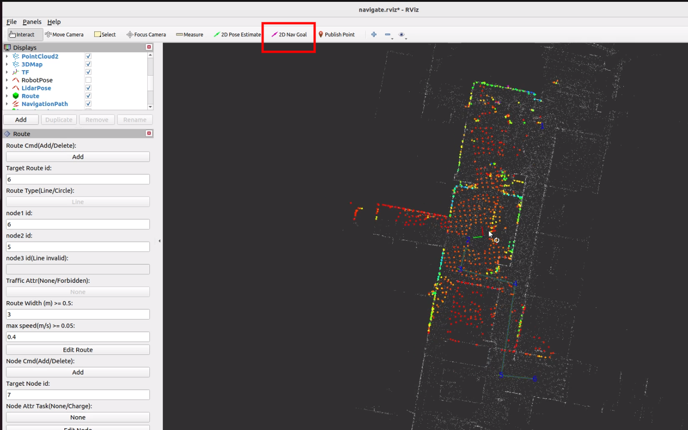

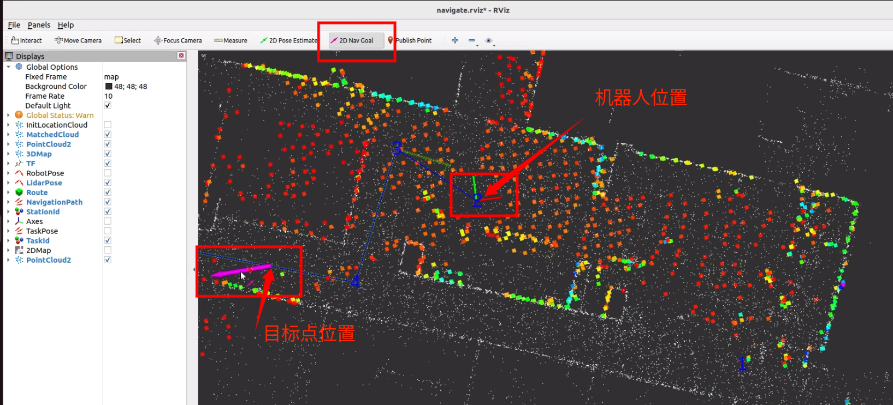

### 任务点导航

#### 界面操作

* 任务点设置完成以后，可以在界面中导航去对应的任务点，即在 manualtask 中选择要去的任务点，选择完成以后机器人就会导航到该位置。

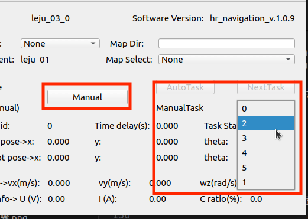

#### 代码操作

* 调用 /srv_set_task 服务增加、删除、重命名任务点

```bash
rosservice call /srv_edit_task "{cmd: '', name_task: '', id_task: 0, attr_task: '', name_new: '', time_delay: 0.0,
  x: 0.0, y: 0.0, theta: 0.0}" 
```