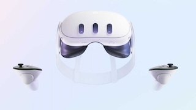
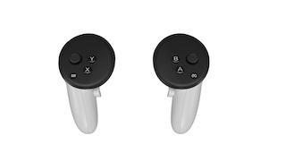
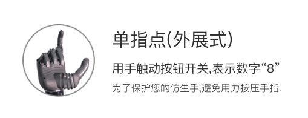
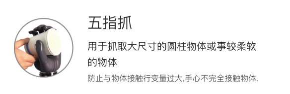
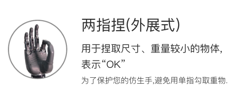
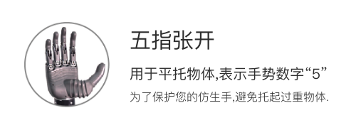
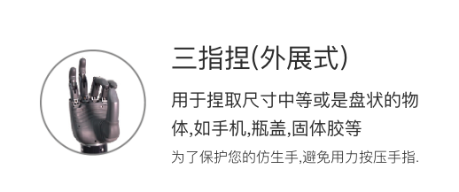
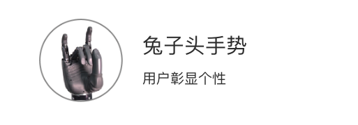
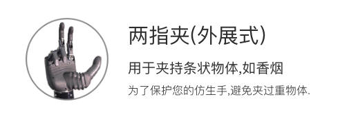

# VR使用开发案例

- [VR使用开发案例](#vr使用开发案例)
  - [说明](#说明)
    - [QUEST 3 设备](#quest-3-设备)
    - [手柄](#手柄)
  - [Quest3 相关使用](#quest3-相关使用)
    - [介绍](#介绍)
    - [安装 SideQuest](#安装-sidequest)
    - [如何更新 Quest3 的系统固件](#如何更新-quest3-的系统固件)
    - [如何启动已安装的程序](#如何启动已安装的程序)
    - [如何导出已录制的视频](#如何导出已录制的视频)
    - [如何去除空间限制](#如何去除空间限制)
  - [QUEST3 VR控制](#quest3-vr控制)
    - [准备](#准备)
    - [使用](#使用)


## 说明

- 本案例使用VR设备为Quest3，可以通过VR手柄实现机器人手臂和灵巧手的遥操以及机器人的基本运动，可用于具身智能的数据采集。

### QUEST 3 设备

- 

### 手柄

- 


## Quest3 相关使用
### 介绍

在使用遥操作的时候我们需要用到 Quest3 的设备来捕捉用户的动作控制机器人来搜集数据。在这个文档中我们会介绍在使用 Quest3 的过程中会遇到的几个问题或者需要用到的操作

### 安装 SideQuest

如果无法下载，可以使用我们提供的源来安装。我们提供的地址是：[SideQuest下载地址](https://kuavo.lejurobot.com/Quest_apks/SideQuest-Setup-0.10.42-x64-win.exe "SideQuest 下载地址")，请注意这个源不会和官方的版本同步更新，目前同步的日期是 2024/11/22。请大家如果在发现版本距离久的时候自行下载软件。

基本使用请参考官方视频，或者 Bilili 的视频： [SideQuest的基本使用](https://www.bilibili.com/video/BV1uY41157Ki/?share_source=copy_web&vd_source=2d815abfceff1874dd081e6eb77cc262 "SideQuest基本使用")

如何在 Quest3 里面授权的视频: [Quest3 允许授权](https://www.bilibili.com/video/BV1zzBiYqE8m/?share_source=copy_web&vd_source=2d815abfceff1874dd081e6eb77cc262 "Quest3 允许授权")

### 如何更新 Quest3 的系统固件

目前已知的是 V68 的系统固件版本会存在卡顿和遥控器定位的问题。大家的设备如果是 V68 需要升级系统固件。

升级系统固件需要把 Quest3 连接在一个可以访问 meta 服务器网络的环境下。

具体升级的方法请参考: [Quest3 更新系统固件](https://www.bilibili.com/video/BV1FBBiYMEp4/?share_source=copy_web&vd_source=2d815abfceff1874dd081e6eb77cc262 "Quest3 更新系统固件")

### 如何启动已安装的程序

手柄: [如何启动程序-手柄](https://www.bilibili.com/video/BV1EBBiYKE9B/?share_source=copy_web&vd_source=2d815abfceff1874dd081e6eb77cc262 "如何启动程序-手柄")

手势识别: [如何启动程序-手势](https://www.bilibili.com/video/BV1JBBiYMEmK/?share_source=copy_web&vd_source=2d815abfceff1874dd081e6eb77cc262 "如何启动程序-手势")

### 如何导出已录制的视频

在我们技术支持的时候工程师可能需要大家录制一段在软件里面的操作画面然后发送给我们。

录制视频的方法请参考：[Quest3 录制视频](https://www.bilibili.com/video/BV1U7411p7h2/?share_source=copy_web&vd_source=2d815abfceff1874dd081e6eb77cc262 "Quest3 录制视频")

导出视频的方法请参考: [Quest3 录屏分享](https://www.bilibili.com/video/BV1fzBiYiEa2/?share_source=copy_web&vd_source=2d815abfceff1874dd081e6eb77cc262 "Quest3 录屏分享")

### 如何去除空间限制

默认 Quest3 会需要用户建立一个虚拟空间，当你操作 VR 的时候走出这个空间就会自动暂停我们的程序提示回到虚拟空间上。在展馆之类的场景的时候就有限制。如果想要去掉这个限制，可以参考以下视频。注意：按照视频中说明操作之后主界面的 paththrough 会不起作用，但是进入程序里面是可以透视的，不影响使用。

参考视频：[Quest3 突破空间限制](https://www.bilibili.com/video/BV1iYzwYqEwt/?share_source=copy_web&vd_source=2d815abfceff1874dd081e6eb77cc262 "Quest3 突破空间限制")

## QUEST3 VR控制

### 准备
1. 设备准备：
   - QUEST 3 头显
   - KUAVO_HAND_TRACK VR 应用（请联系乐聚工作人员安装）

2. 网络准备：
   - 确保 VR 设备和机器人连接同一 WiFi

### 使用

- 正常启动机器人完成站立

- 启动VR节点
   - 运行
  
  > 旧版镜像如果没有包含VR相关依赖，需要手动安装：`cd src/manipulation_nodes/noitom_hi5_hand_udp_python && pip install -r requirements.txt && cd -`
  
  ```bash
   source devel/setup.bash

   # VR先和机器人连到同一局域网，查看VR里面的ip地址记下来
   # 然后在机器人上运行以下命令，ip_address输入quest3的ip地址，
   roslaunch noitom_hi5_hand_udp_python launch_quest3_ik.launch ip_address:=192.168.3.32
  ```
  > 如果希望同时映射躯干的运动（上下蹲和弯腰），可以增加选项`control_torso:=1`，使用前**务必在站立状态下长按VR右手柄的meta键**以标定躯干高度。

  > 默认控制双手，如果需要控制单手，可以增加选项`ctrl_arm_idx:=0`, 其中0，1，2分别对应左手，右手，双手
- 全程使用VR的手柄控制即可
  - 启动时按A键站立(从启动等待开始状态站立，相当于kuavo中的按o)；
  - 停止机器人，同时按下左侧XY两个键，停止机器人
  - 自动模式下，推摇杆即走，松摇杆自动立即停止
  - 按下A（stance）、B（walk）也可以手动切换gait
  - 扳机控制手指开合，Y键用于锁定或解锁手指控制
  - 默认摇杆左摇杆控制前后，右摇杆控制左右转；
    - 当手放到一侧的两个按钮上时(只接触不按下)，切换为对侧为控制左右或者高度
    - 如手指覆盖住左侧的XY键，则右侧摇杆切换为高度控制
    - 手贴在左侧XY键，右侧摇杆会自然地变为高度控制，按下去即可关闭程序；
  - x键为模式切换辅助键，按住x键之后,其他按键的作用如下：
    - A:手臂模式切换为外部控制/自动摆手，这两种模式切换之后会有一个平滑同步到当前规划轨迹的过程
    - B:手臂模式切换为保持姿态
  
 > 开启手势识别，可以增加选项 `predict_gesture:=true`，利用神经网络预测手势，灵巧手会直接根据手势预测结果进行运动，目前支持的手势有（只有当预测结果同时满足：高置信度（>80%）明显优于第二预测（差值>0.3）预测分布集中（熵值<0.8）才会返回具体的手势类别。否则会认为预测失败，灵巧手会采用原来的方式控制）
1. **单指点（外展式）**  
   

2. **五指抓取**  
   

3. **666手势**  
   

4. **两只捏（外展式）**  
   

5. **握拳**  
   `fist`

6. **点赞**  
   `thumbs-up`

7. **五指张开**  
   

8. **三指捏**  
   

9. **兔子头手势**  
   

10. **二指夹（外展式）**  
    