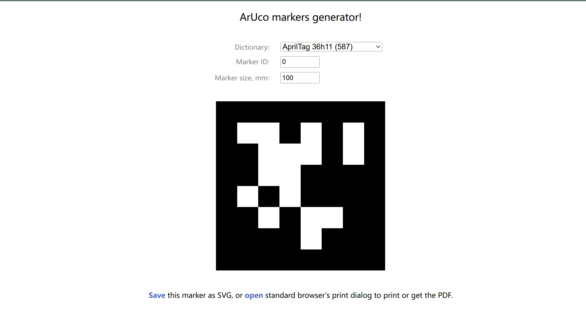

# 二维码检测使用案例

## 二维码
- [二维码下载网站](https://chev.me/arucogen/)
- 使用的二维码类型为apriltag，类型为36h11


## 使用
- 调整配置文件
  - 配置文件位于 `~/kuavo_ros_application/src/ros_vision/detection_apriltag/apriltag_ros/config/tags.yaml`
  ```yaml
  standalone_tags:
  [
    {id: 0, size: 0.042, name: 'tag_0'},
    {id: 1, size: 0.042, name: 'tag_1'},
    {id: 2, size: 0.042, name: 'tag_2'},
    {id: 3, size: 0.04, name: 'tag_3'},
    {id: 4, size: 0.04, name: 'tag_4'},
    {id: 5, size: 0.04, name: 'tag_5'},
    {id: 6, size: 0.04, name: 'tag_6'},
    {id: 7, size: 0.04, name: 'tag_7'},
    {id: 8, size: 0.04, name: 'tag_8'},
    {id: 9, size: 0.04, name: 'tag_9'},
  ]
  ```
  修改/添加对应要识别的目标二维码id以及尺寸，单位为m
- 启动上位机主程序
```bash
sros1
source devel/setup.bash 
roslaunch dynamic_biped load_robot_head.launch 
```
- rqt观察识别效果

```
rqt_image_view
```
选择 `/tag_detections_image` topic

<iframe src="//player.bilibili.com/player.html?isOutside=true&aid=113667282572395&bvid=BV1d1k7YWE6g&cid=27387363930&p=1" 
        width="320" height="320" 
        scrolling="no" border="0" frameborder="no" framespacing="0" allowfullscreen="true">
</iframe>

## 示例程序
```python
#!/usr/bin/env python

import rospy
from kuavo_sdk.msg import AprilTagDetectionArray
import math
import numpy as np  # 引入numpy库用于数值计算


class AprilTagProcessor:
    def __init__(self, is_init=False):
        """
        初始化AprilTagProcessor类。
        :param is_init: 是否初始化ROS节点，默认为False。
        """
        if is_init:
            rospy.init_node('tag_detections_listener', anonymous=True)

    def quaternion_to_euler(self, w, x, y, z):
        """
        将四元数转换为欧拉角（yaw）。
        :param w, x, y, z: 四元数的分量。
        :return: 以度为单位的yaw角。
        """
        # 计算roll, pitch, yaw
        sinr_cosp = 2 * (w * z + x * y)
        cosr_cosp = 1 - 2 * (y**2 + z**2)
        roll = math.atan2(sinr_cosp, cosr_cosp)

        sinp = 2 * (w * y - z * x)
        pitch = math.asin(sinp) if abs(sinp) < 1 else math.copysign(math.pi / 2, sinp)

        siny_cosp = 2 * (w * x + y * z)
        cosy_cosp = 1 - 2 * (x**2 + y**2)
        yaw = math.atan2(siny_cosp, cosy_cosp)

        return math.degrees(yaw)

    def get_apriltag_data(self):
        """
        从指定的ROS话题中获取AprilTag检测数据。
        :return: 包含每个AprilTag信息的列表。
        """
        try:
            # 等待从话题"/robot_tag_info"接收到AprilTagDetectionArray消息
            msg = rospy.wait_for_message("/robot_tag_info", AprilTagDetectionArray, timeout=5)
        except rospy.ROSException as e:
            rospy.logerr(f"未能获取到 AprilTag 数据: {e}")
            return None

        data_list = []
        for detection in msg.detections:
            id = detection.id[0]  # 获取AprilTag的ID
            quaternion = detection.pose.pose.pose.orientation  # 获取姿态的四元数
            pos = detection.pose.pose.pose.position  # 获取位置

            # 将四元数转换为yaw角
            yaw_angle = self.quaternion_to_euler(quaternion.x, quaternion.y, quaternion.z, quaternion.w)

            # 构建AprilTag数据字典
            tag_data = {
                "id": id,
                "off_horizontal": round(pos.x, 3),
                "off_camera": round(pos.y, 3),
                "off_vertical": round(pos.z, 3),
                "yaw_angle": yaw_angle
            }
            data_list.append(tag_data)

        return data_list

    def get_apriltag_by_id(self, tag_id):
        """
        根据ID获取特定的AprilTag数据。
        :param tag_id: 要查找的AprilTag的ID。
        :return: 匹配的AprilTag数据字典。
        """
        all_tags = self.get_apriltag_data()
        if all_tags is None:
            rospy.logerr("未能获取到 AprilTag 数据")
            return None

        for tag in all_tags:
            if tag["id"] == tag_id:
                return tag

        return None

    def get_averaged_apriltag_data(self, tag_id, num_samples=10):
        """
        获取指定ID的AprilTag的平均位置和姿态数据。
        :param tag_id: 要查找的AprilTag的ID。
        :param num_samples: 用于计算平均值的样本数量，默认为10。
        :return: 包含平均位置和姿态的字典。
        """
        data_list = []

        while len(data_list) < num_samples:
            tag_data = self.get_apriltag_by_id(tag_id)
            if tag_data:
                data_list.append(tag_data)

        # 使用numpy计算平均值
        avg_off_horizontal = np.mean([tag["off_horizontal"] for tag in data_list])
        avg_off_camera = np.mean([tag["off_camera"] for tag in data_list])
        avg_off_vertical = np.mean([tag["off_vertical"] for tag in data_list])
        avg_yaw_angle = np.mean([tag["yaw_angle"] for tag in data_list])

        result = {
            "id": tag_id,
            "avg_off_horizontal": round(avg_off_horizontal, 3),
            "avg_off_camera": round(avg_off_camera, 3),
            "avg_off_vertical": round(avg_off_vertical, 3),
            "avg_yaw_angle": round(avg_yaw_angle, 3)
        }
        rospy.loginfo(f"AprilTag ID: {result['id']}, 位置: x={result['avg_off_horizontal']}, y={result['avg_off_camera']}, z={result['avg_off_vertical']}, 倾斜角: {result['avg_yaw_angle']}")
        return result


if __name__ == '__main__':
    # 创建AprilTagProcessor实例并初始化ROS节点
    processor = AprilTagProcessor(is_init=True)
    # 获取指定ID的AprilTag的平均数据
    tag_data = processor.get_averaged_apriltag_data(tag_id=1)
```

## 获取检测结果
- 基于相机坐标系：`/tag_detections_image`;基于机器人基坐标系：`/robot_tag_info`
- 修改示例程序中订阅话题可以获取二维码基于相机坐标系和基于机器人基坐标系的不同位姿信息
- 执行示例代码
```sh
cd 4功能案例/通用案例/scripts
python3 get_tag_info.py
```

## 示例代码说明

- **`AprilTagProcessor`类**：负责处理AprilTag的检测数据，包括初始化ROS节点、转换四元数到欧拉角、获取AprilTag数据、根据ID查找AprilTag以及计算AprilTag的平均数据。
- **`quaternion_to_euler`函数**：将四元数转换为欧拉角中的yaw角，用于表示旋转。
- **`get_apriltag_data`函数**：从ROS话题中获取AprilTag检测数据，并提取每个标签的ID、位置和姿态。
- **`get_apriltag_by_id`函数**：根据指定的ID查找AprilTag数据。
- **`get_averaged_apriltag_data`函数**：获取指定ID的AprilTag的多次检测数据，并计算其平均位置和姿态。
- **主程序**：创建`AprilTagProcessor`实例，初始化ROS节点，并获取指定ID的AprilTag的平均数据。