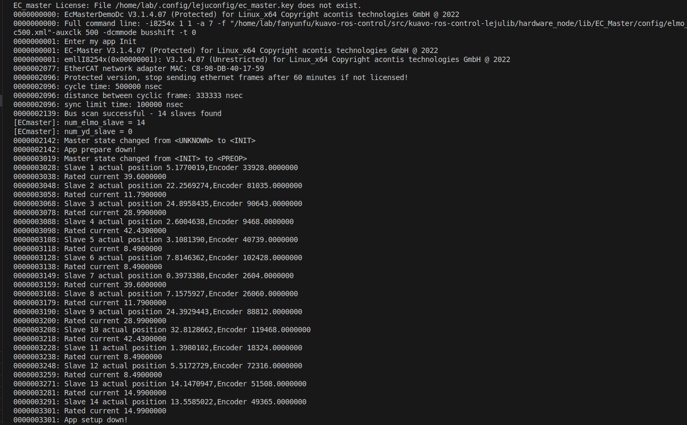

- [下位机](#下位机)
  - [开源仓库](#开源仓库)
  - [基础信息](#基础信息)
  - [连接](#连接)
  - [确认机器人版本和总质量](#确认机器人版本和总质量)
      - [机器人版本](#机器人版本)
      - [机器人质量](#机器人质量)
  - [编译](#编译)
    - [docker环境](#docker环境)
    - [实机环境](#实机环境)
  - [运行](#运行)
    - [仿真运行](#仿真运行)
    - [实物运行](#实物运行)
    - [键盘控制](#键盘控制)
- [上位机](#上位机)
  - [开源仓库](#开源仓库-1)
  - [基础信息](#基础信息-1)
  - [功能包说明](#功能包说明)
  - [快速构建 \& 快速启动](#快速构建--快速启动)
    - [下载代码 \& 构建工作空间](#下载代码--构建工作空间)
    - [Launch启动传感器感知节点](#launch启动传感器感知节点)
    - [launch文件说明](#launch文件说明)


# 下位机
## 开源仓库
```shell
# https
git clone https://www.lejuhub.com/highlydynamic/craic_code_repo.git

# ssh
git clone ssh://git@www.lejuhub.com:10026/highlydynamic/craic_code_repo.git
```

切换分支
```shell
git checkout dev
```

## 基础信息

* 用户名：lab
* 密码："   "(三个空格)
* Ubuntu 版本：20.04
* ROS 版本：noetic

## 连接
- 连接wifi，获取机器人IP(通过拓展口接显示屏、键盘、鼠标进行操作)
- 连接下位机：

```bash
ssh lab@机器人IP地址
```


## 确认机器人版本和总质量
#### 机器人版本
- 机器人版本通过环境变量`$ROBOT_VERSION`设置，版本号涉及不同机器人模型、硬件设置等, 需要和自己的机器人匹配。
- 在终端执行`echo $ROBOT_VERSION`查看当前设置的版本号，如果没有设置，通过以下设置版本号(其中的42代表4pro版本，根据实际情况修改)：

   1. 在当前终端执行(临时设置): 

     `export ROBOT_VERSION=42`

   2. 将其添加到你的 `~/.bashrc` 或者 `~/.zshrc` 终端配置文件中:
    如执行: 

        `echo 'export ROBOT_VERSION=42' >> ~/.bashrc `

    添加到 `~/.bashrc` 文件(bash终端)末尾，重启终端后生效


#### 机器人质量
- 由于每台机器人的选配不同，质量也不同，需要确认机器人的总质量，确保模型准确。(出厂时的质量会修改正确一次)
- 机器人总质量存储于`~/.config/lejuconfig/TotalMassV${ROBOT_VERSION}`文件中(${ROBOT_VERSION}为上述设置的版本号)，编译时会自动读取该文件，校准仓库中的模型质量。
- 机器人称重之后，将总质量写入`~/.config/lejuconfig/TotalMassV${ROBOT_VERSION}`文件中即可。
- ocs2中使用了cppad自动微分库，cppad的缓存与模型相关
  - 因此每次修改总质量文件时，会`自动`删除缓存目录`/var/ocs2/biped_v${ROBOT_VERSION}`, 下一次运行时会自动重新编译cppad模型(大概4分钟)
  - 如果手动修改了仓库中的模型，同样需要删除缓存目录，重新编译cppad模型


## 编译

### docker环境
在没有机器人运行环境的情况下，可以使用docker环境进行编译和仿真使用。

- 参考[仿真环境使用](/3开发接口/仿真环境使用.md)

### 实机环境

- kuavo实机镜像如果较旧，需要手动安装一些依赖项：
```bash
# 提供了一个脚本用于快速在旧的kuavo实机镜像进行安装依赖
./docker/install_env_in_kuavoimg.sh
```

- 实物编译
```bash
cd kuavo-ros-control #仓库目录
catkin config -DCMAKE_ASM_COMPILER=/usr/bin/as -DCMAKE_BUILD_TYPE=Release # Important! 
source installed/setup.bash # 加载一些已经安装的ROS包依赖环境，包括硬件包等
catkin build  humanoid_controllers
```

## 运行

### 仿真运行

- 参考[仿真环境使用](/3开发接口/仿真环境使用.md)

### 实物运行
- 实物运行时，开机第一次需要先在cali模式下运行一次，确认机器人姿态和位置正确(机器人所有关节回到零位)

```bash
source devel/setup.bash
roslaunch humanoid_controllers load_kuavo_real.launch cali:=true # 以校准模式启动
```
- 零点标定
   - 机器人的零点是指所有电机在零位置时的位置, 此时机器人姿态处于完全伸直的状态；
   - 零点标定在机器人出厂时会完成一次，除非更换电机或者编码器，其他情况只需要进行`重启之后的实物零点校准`流程即可。
   - 电机的零点存储有两个地方:
      1. 腿部和肩膀两个电机的零点位置存储于`~/.config/lejuconfig/offset.csv`文件中, 每个关节对应一行, 顺序为从躯干出发,左腿、右腿、左肩、右肩的电机;
         - 腿部零点手动标定过程：
            - 将机器人所有关节摆到零位(可以使用工装等硬件设备进行固定)
            - 打开机器人急停按键给机器人电机上电
            - 运行程序（增加cali:=true参数），在使能完腿部电机后(打印出如下图的位置之后), 即可关闭程序(零点校准之前电机运动可能会超出限位)
            - 
            - 其中的`Slave xx actual position 5.1770019`即这个电机的实际位置
            - 将需要标零的电机位置复制到`offset.csv`文件中对应的行中即可, 注意不要有多余的空行
         - 腿部零点辅助标定过程：
            - 将机器人所有关节摆到零位(可以使用工装等硬件设备进行固定)
            - 打开机器人急停按键给机器人电机上电
            - 运行程序（增加**cali_leg:=true**参数）
            - 腿部电机进入使能状态之后，按'c'键，自动保存腿部**当前位置**作为零点
      2. 手臂的零点位置存储于`~/.config/lejuconfig/arms_zero.yaml`文件中,如需微调某个关节可以调整
            - 手臂校准在**root**下执行`rosrun hardware_node setZero.sh`将会以当前手臂位置作为零点并保存到配置文件中;
            - 多圈的情况下手臂后续无需校准, 没有多圈记忆功能的机器**重启之后**需要按下述手臂校准流程校准手臂零点所在圈数
   - **电机的运动方向**：
     - 电机的旋转方向和机器人的坐标系正方向一致，符合右手定则。
     - 机器人正方向：往前->x轴正方向，往左->y轴正方向，往上->z轴正方向。
     - 比如1号髋关节roll轴心与机器人x轴平行，则该电机根据右手定则，绕着机器人x轴旋转的方向即为正方向。
     - 再如：踝关节是由并联杆控制，两个电机轴心与机器人y轴平行(4代)，则该电机根据右手定则，绕着机器人y轴旋转的方向即为正方向。
     - > 注意：膝关节比较特殊，膝关节正方向判断应该看关节的旋转方向而不是看电机的旋转方向(4代上无影响，4pro上的反关节会有差异)
- **重启之后**, 实物零点校准。
   - 在4pro(4.2版本)以下的机器人，没有多圈编码器记忆功能，**每次开机**需要校准各个电机的位置，方式有两种：
   1. 手动校准
      - 开机时手动掰机器人各个关节的电机回到零位所在圈数内，打开机器人急停按键给机器人电机上电
      - 运行程序，机器人进入全身伸直姿态，看所有关节是否都回到零位，如果不在零位处，则单独反方向掰动该关节，关闭再重新打开急停按键，重复运行程序步骤直到所有关节都回到零位
   2. 辅助校准，在`cali:=true`模式下, 提供了一个辅助校准流程：
      - 运行程序，机器人进入全身伸直姿态，看所有关节是否都回到零位
      - 如果需要校准，则根据终端提示输入'c'进入腿部校准模式, 输入'v'进入手部校准模式
      - 校准腿部的模式下：
            1. 输入 'l' 或 'r' 选择要校准的左腿或右腿。
            2. 输入 1-6 选择要校准的电机。
            3. 输入 'w' 增加编码器圈数，输入 's' 减少编码器圈数（注意：电机会移动！）
            4. 输入 'c' 保存校准结果(断电之前都无需重新校准)，输入 'q' 退出校准。
      - 校准手部的模式下：
            1. 输入 'l' 或 'r' 选择要校准的左手或右手。
            2. 输入 2-7 选择要校准的电机(只校准瑞沃关节的电机)。
            3. 输入 'w' 增加编码器圈数，输入 's' 减少编码器圈数（注意：电机会移动！）
            4. 输入 'd' 将手臂电机掉使能(此时可以掰动手臂电机), 输入 'e' 重新使能
            5. 输入 'f' 以当前手臂位置作为零点并保存
            6. 输入 'c' 保存校准结果(断电之前都无需重新校准)，输入 'q' 退出校准。
      
      - 根据需要通过上述按键组合逐圈调整电机, 直到所有关节都回到零位所在圈。
      - > 注意：按`w`和`s`键时，请仔细确认运动方向正确，不要反方向调节，否则会触发电机的限位保护，程序退出。
   3. 手臂的位置需求不那么准确时，可以通过`cali`模式下再传入一个`cali_arm=true`，将会以当前位置作为手臂的零点，并保存到配置文件中。
> 注意：没有多圈编码器记忆功能的版本，电机断电之后，开机都需要手动校准一次;腿部的辅助校准功能只用于关机重启之后**校准编码器圈数**, 即需要确认此前的腿部零点是正常的, 否则请先手动校准一次。

> `Ctrl+C`结束校准

> 💡 校正失败时：按下急停断电，重新调整位置后重试


- 之后直接按`o`启动机器人，后续运行正常运行即可
```bash
source devel/setup.bash
roslaunch humanoid_controllers load_kuavo_real.launch
```
- 运行程序之后，机器人会进入待站立阶段，确认无误之后，准备扶住机器人，然后按`o`启动机器人，机器人会开始运动到站立状态，并开启反馈控制。

### 键盘控制

1. ⚠️ 使用前请确保：

- 了解急停按钮位置
- 如遇异常立即按下红色急停按钮
- 按下急停后需重新校准(多圈编码器则不需要)
- 控制机器人移动时请注意速度

2. 启动机器人程序：

```bash
cd kuavo-ros-opensource && sudo su
source devel/setup.bash
roslaunch humanoid_controllers load_kuavo_real.launch joystick_type:=sim
```

- 等待腿部缩起
- 将机器人放至离地 2cm 处

3. 打开键盘控制终端：

```bash
cd kuavo-ros-opensource
source devel/setup.bash
rosrun humanoid_interface_ros joystickSimulator.py
```

3. 核心按键：

- `O`: 从悬挂准备阶段切换到站立(需要有人用力扶住机器人背部，以免摔倒)
- `WASD`: 前后左右移动
- `IKJL`: 上下和转向
- `C`: 站立模式
- `R`: 普通行走
- `T`: 快速行走
- `空格`: 重置所有速度为0
- `B`: 结束程序(使用前请先让机器人蹲下)
- `Control+C`: 结束程序

# 上位机

## 开源仓库
```shell
# https
git clone https://gitee.com/leju-robot/kuavo_ros_application.git
```

## 基础信息

* 用户名：kuavo
* 密码：leju_kuavo
* Ubuntu 版本：22.04
* ROS 版本：noetic + humble

## 功能包说明
* ros_audio: 音频流集合
```markdown
kuavo_audio_player   -- 播放音频功能包
kuavo_audio_recorder -- 录制音频功能包
```

* ros_sensor_integration:通用传感器基础节点数据流集合
```markdown
ros_realsense
* ddynamic_reconfigure -- realsense动态参数功能包
* realsense2_camera -- realsense相机功能包
* realsense2_description -- realsense相机模型功能包
```

* livox_ros_driver2: 雷达驱动功能包

* ros_robotModel:机器人模型集合，用于存放Kuavo机器人的urdf及mesh碰撞体，可用于规划仿真或者导航仿真
```markdown
biped_s4 -- Kuavo4代机器人模型功能包
biped_s42 -- Kuavo4pro机器人模型功能包
```

* ros_vision:视觉功能集合，用于处理视觉数据的节点和工具。这可能包括对象检测、识别、姿态估计和图像处理等功能的实现。
```markdown
detection_apriltag 
* 里面包含了AprilTag的识别 
* 将目标转换至机器人世界坐标系

detection_yolo     
* 里面包含了yolov5的识别推理 
* 将目标转换至机器人世界坐标系
* 将识别出来的目标的进行点云分割（包含基于Boundingbox的分割 和 SegmentMask像素区域分割）
```

## 快速构建 & 快速启动
### 下载代码 & 构建工作空间
```bash
git clone https://www.lejuhub.com/ros-application-team/kuavo_ros_application.git   # Clone Apriltag library
cd ~/kuavo_ros_application
git checkout dev
source /opt/ros/noetic/setup.bash

catkin build apriltag_ros dynamic_biped livox_ros_driver2 -DROS_EDITION=ROS1  # 优先编译apriltag_ros dynamic_biped livox_ros_driver2
catkin build               # 之前所有功能包进行编译
```
### Launch启动传感器感知节点
```bash
cd ~/kuavo_ros_application
source /opt/ros/noetic/setup.bash
source ~/kuavo_ros_application/devel/setup.bash 

roslaunch dynamic_biped load_robot_head.launch 
```

### launch文件说明
```xml
<launch>
    <!-- 定义模型路径选项 -->
    <arg name = "using_s42" default = "true"/>

    <!-- 4pro模型 -->
    <arg name="model" if="$(arg using_s42)" default="$(find biped_s42)/urdf/biped_s42_head.urdf"/>

    <!-- 4代模型 -->
    <!-- <arg name="model" default="$(find biped_s4)/urdf/biped_s4_head.urdf"/> -->
    <arg name="model" unless="$(arg using_s42)" default="$(find biped_s4)/urdf/biped_s4_head.urdf"/>

    <arg name="rvizconfig" default="$(find dynamic_biped)/biped_s4_head.rviz" />

    <!-- 发布机器人描述 -->
    <param name="robot_description" command="$(find xacro)/xacro $(arg model)" />
    <node name="joint_state_republisher" pkg="dynamic_biped" type="joint_state_republisher" output="screen" />

    <!-- 启动 robot_state_publisher，用于发布TF树 -->
    <node name="robot_state_publisher" pkg="robot_state_publisher" type="robot_state_publisher" />

    <!-- 启动 RViz，并加载指定的配置文件 -->
    <node name="rviz" pkg="rviz" type="rviz" args="-d $(arg rvizconfig)" required="true" />

    <!-- 启动头部 realsense2_camera 相机  -->
    <include file="$(find realsense2_camera)/launch/rs_camera.launch" >
        <arg name="color_width"   value="640"/>
        <arg name="color_height"  value="480"/>
        <arg name="color_fps"     value="30"/>
        <arg name="depth_width"   value="848"/>
        <arg name="depth_height"  value="480"/>
        <arg name="depth_fps"     value="30"/>
        <arg name="enable_infra"        default="false"/>
        <arg name="enable_infra1"       default="false"/>
        <arg name="enable_infra2"       default="false"/>
        <arg name="enable_sync"   value="true"/>
        <arg name="align_depth"   value="true"/>
        <arg name="enable_pointcloud"   value="true"/>
    </include>

    <!-- tf2_ros 静态转换 发布urdf里面的head_camera 和 相机坐标系下的camera_link 进行对齐 -->
    <node pkg="tf2_ros" type="static_transform_publisher" name="camera_to_real_frame" args="0 0 0 0 0 0 head_camera camera_link" />
    <node pkg="tf2_ros" type="static_transform_publisher" name="base_link_to_torso" args="0 0 0 0 0 0 base_link torso" />

    <!-- 启动 apriltag_ros continuous_detection -->
    <include file="$(find apriltag_ros)/launch/continuous_detection.launch">
      <arg name="camera_name" value="/camera/color" />
      <arg name="image_topic" value="image_raw" />
    </include>

    <!-- 启动 ARControlNode -->
    <node pkg="ar_control" type="ar_control_node.py" name="ar_control_node" output="screen" respawn="true" respawn_delay="5" />

    <!-- 启动 播放音乐服务 -->
    <node pkg="kuavo_audio_player" type="loundspeaker.py" name="play_music_node" output="screen" respawn="true" respawn_delay="5"/>

</launch>
```
- 可以自行根据需求选择需要启动功能节点，降低nuc的性能占用