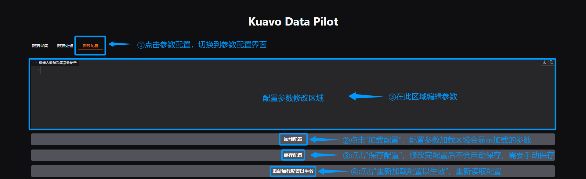
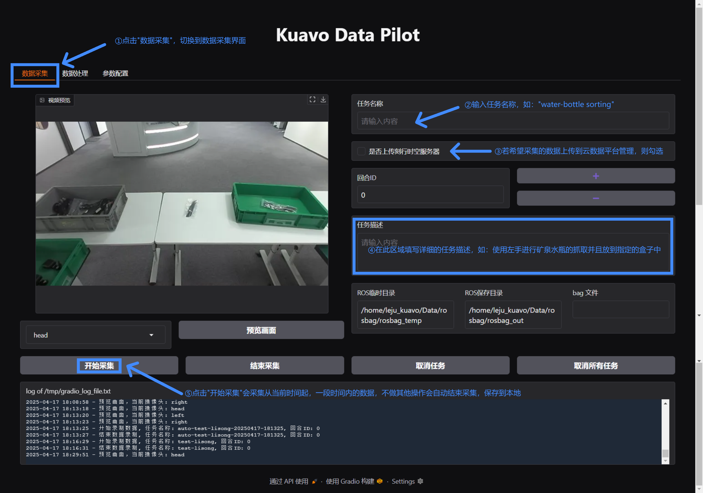
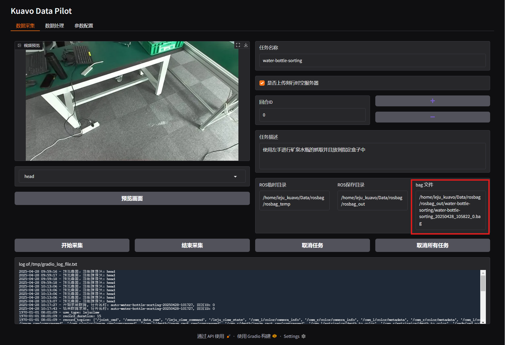
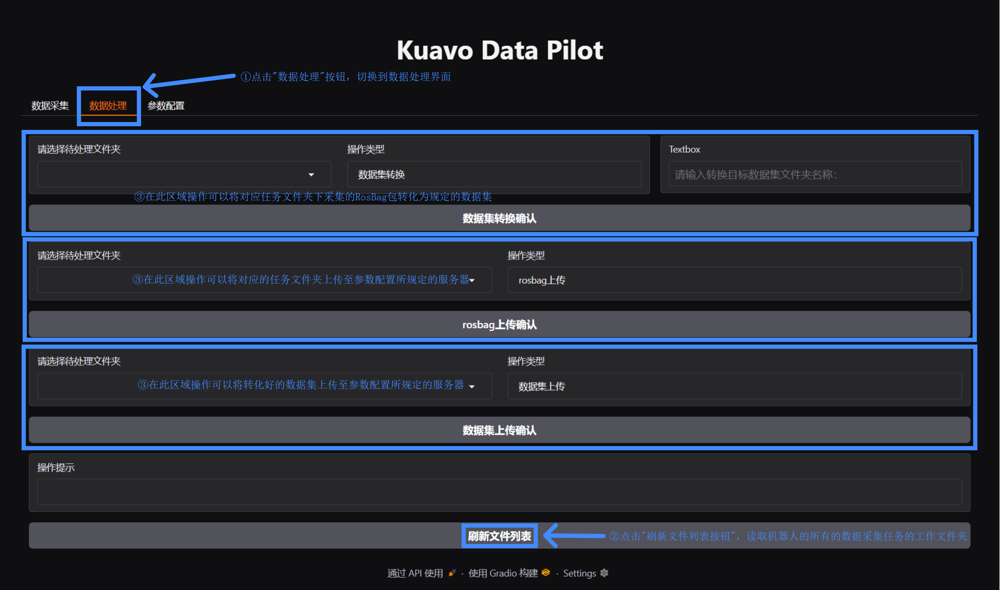
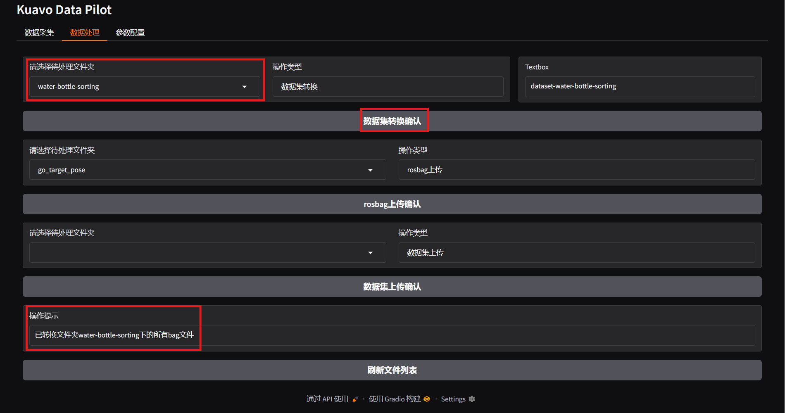

# 数据采集

## 一、 章节介绍

数据采集是采集基于`ROS`录制某一时间段机器人行为生成的`RosBag`包，可将其视为原始数据。但提供给模型训练的数据是经过转化的数据，因此，本数据采集系统除提供最基础的**数据采集**功能外，还提供了**数据处理**功能。同时，鉴于机器人末端不同、资源存储路径存在差异等原因，本数据采集系统提供了灵活的**参数配置**。

## 二、 进入平台 {#data-collection-push}

机器人搭载了两块`NUC`，`NVIDIA Jetson AGX Orin`作为**上位机**，`摩方i9-13900`作为**下位机**。详细参数见[参考资料](#reference-material)。采集系统框架（`kuavo_brain`）、模型训练部署框架（`kuavo_il`）都在**上位机**上。所以进入采集平台前要获得要获得**上位机**在局域网中的ip。

### 1. 操作说明

1.使用网线将上位机(`NVIDIA Jetson AGX Orin`)与路由器连接，打开路由器后台查看对应的设备的IP

2.使用在后台查询到的设备的IP，进行`SSH`连接。用户名和密码如下：


```bash
# 路由器下查询到的IP
192.168.23.32
# 用户名
leju_kuavo
# 密码
leju_kuavo
```
3.将上位机与路由器通过wifi连接

```bash
# 扫描附件的wifi
sudo nmcli d wifi list
# 选择wifi进行连接
sudo nmcli d wifi connect '[wifi名称]' password [wifi密码]
```
4.查看通过wifi连接的IP(wlan0)

```bash
ifconfig
```

5.打开浏览器，在地址栏输入，按下回车访问

```bash
192.168.32.23:7860
```
::: warning 注意事项
- 浏览器地址栏输入的地址是由[通过wifi连接的IP]+[端口号7860]组成的
:::

## 三、 参数配置 {#data-collection-config}
在开始数据采集前你需要对采集的参数进行配置
### 1. 操作说明

1.首先点击`TAB`栏的"参数配置"进行数据采集、数据处理的详细参数的配置。

2.然后点击"加载配置"，"配置参数修改区域"会显示配置在机器人中的有关"数据采集"的配置。

3.接着在"配置参数修改区域"编辑参数。

4.紧接着点击"保存配置"会将配置文件的内容更改并且写入。

5.最后点击"重新加载配置以生效"会使得本系统重新加载配置参数。操作如下图所示。



### 2. 属性说明

以下是对于配置参数属性的详细说明


|         属性名          |     类型      |                    说明                     |
| :---------------------: | :-----------: | :-----------------------------------------: |
|     rosbag_save_dir     |    String     |      数据采集录制完成后bag包存储的位置      |
|     rosbag_temp_dir     |    String     |    数据采集录制过程中临时bag包存储的位置    |
|    dataset_save_dir     |    String     |           转换后数据集存储的位置            |
|    episode_duration     |    Integer    |         每个数据采集片段的持续时间          |
|        server_ip        |    String     | 转化后数据集/RosBag上传的目标服务器网络地址 |
|     server_username     |    String     |  转化后数据集/RosBag上传的目标服务器用户名  |
|     server_password     |    String     |   转化后数据集/RosBag上传的目标服务器密码   |
| server_rosbag_save_dir  |    String     |    RosBag上传的目标服务器的文件目录地址     |
| server_dataset_save_dir |    String     | 转化后数据集上传的目标服务器的文件目录地址  |
|      use_lejuclaw       |    Boolean    |  是否使用lejuclaw(机器人末端是否使用夹爪)   |
|      use_qiangnao       |    Boolean    | 是否使用qiangnao(机器人末端是否使用灵巧手)  |
|    only_half_up_body    |    Boolean    |            是否仅采集上半身数据             |
| record_topics_lejuclaw  | Array[String] |     使用lejuclaw时需要记录的ROS话题列表     |
| record_topics_qiangnao  | Array[String] |     使用qiangnao时需要记录的ROS话题列表     |

## 四、 数据采集 {#data-collection-start}

### 1. 操作说明

1.首先点击`TAB`栏的"数据采集"开始进行数据采集。

2.然后输入任务名称如：`water-bottle-sorting`

3.接着可以勾选"是否上传刻行时空"，如果勾选会自动将采集的数据上传到云数据存储平台

4.紧接着然后输入任务描述如："使用左手进行矿泉水瓶的抓取并且放到指定盒子中"

5.VR操作手开始准备采集，VR操作方式如下

>**STEP1-启动机器人**：
>​	[点击查看启动机器人的视频教程](https://www.bilibili.com/video/BV1sECgYXEb8/?spm_id_from=888.80997.embed_other.whitelist&t=44.179363&bvid=BV1sECgYXEb8)
> 01. 机器人开机后，将机器人双脚拉直。调整移位机高度，使机器人双脚吊离地面约10cm
> 02. 机器人双手竖直下垂，摆正各关节电机，使左右手臂从肩部到手臂末端形成一条直线
> 03. 摆正机器人各关节位置如视频20s所示
> 04. 机器人开机，遥控器长按电源键开机；机器人开机后需等待约1分钟与遥控器建立连接
> 05. 遥控器执行校准：左侧挡位拨到最左边，右侧挡位拨到最右边，按下D键，等待机器人执行校准
> 06. 校准过程中观察机器人各关节状态，如果出现异常转动及时拍下急停避免卡住限位
> 07. 校准成功后机器人全身关节使能，状态如视频所示
>	08. 遥控器长按"C+D"，结束校准
>	09. 遥控器执行站立前缩腿：左侧挡位拨到最左边，右侧挡位拨到最右边，按下C键，等待机器人缩腿
>	10. 移位机下放至机器人双脚离地10cm左右，按下C键，机器人站立
> 11. ​移位机下放，避免安全绳拽到机器人


>**STEP2-开始VR操控模式**：
>​	[点击查看机器人启动VR操作教程](https://www.bilibili.com/video/BV1x7CgYWESu/?spm_id_from=888.80997.embed_other.whitelist&bvid=BV1x7CgYWESu)
> 01. 遥控器A键进入到VR控制模式（长按B键回到遥控器控制模式）
> 02. 选择左下角快速设置，点击进入选择WIFI并连接，确保机器人与VR连接在同一网络下
> 03. 回到VR端桌面，右下角选择Kuavo-Hand-Track-MR软件点击进入


>**STEP3-VR操控**：
>​	[点击查看机器人进行VR操作教程](https://www.bilibili.com/video/BV1x7CgYWE8i/?spm_id_from=888.80997.embed_other.whitelist&bvid=BV1x7CgYWE8i)
> 01. 左右手分别拿住两个手柄
> 02. 机器人头部：自动跟随人体头部运动
> 03. 按下右手柄B键：原地踏步
> 04. 左手摇杆控制机器人移动的前后，右手摇杆左右控制机器人移动的左右旋转
> 05. 按下右手柄A键：回到站立状态
> 06. 左右手柄上扳机分别控制左右手指开合，左手Y键用于锁定或解锁手指控制
> 07. 手指放到X、A键上(不按下)会分别触发左右灵巧手的大拇指向内侧运动
>	08. 按住X键后再按下A键解锁手臂，等待5秒用户与机器人手臂同步，完成后机器人手臂可跟随人手臂运动
>	09. 再次先按住X键，再按下A键，手臂回到初始位置，踏步时会跟随摆手
>	10. 同时按下左右手柄下扳机，手臂在当前位置锁住
> 11. 同时按下左右手柄上扳机，机器人手臂恢复跟随
> 12. 同时按左手"X+Y"键，机器人全身关节解锁(建议回到遥控器解锁机器人)


6.最后点击"开始采集"此时需要VR操作员配合完成在"指定时间内(参数配置中的`episode_duration`所指定的时间)"的特征动作。操作如下图所示。



7.操作成功后可以根据提示查看`RosBag`包的存储位置。之后的数据转化的对象是`/home/leju_kuavo/Data/rosbag/rosbag_out/water-bottle-sorting`。



- 此时配置的参数如下
```yaml
"rosbag_save_dir": "/home/leju_kuavo/Data/rosbag/rosbag_out",
"rosbag_temp_dir": "/home/leju_kuavo/Data/rosbag/rosbag_temp"
```
- 如果新建的采集任务是`water-bottle-sorting`，则第一次采集的成功的`RosBag`包`water-bottle-sorting_20250427_171557_0.bag`的存储位置为：
```bash
/home/leju_kuavo/Data/rosbag/rosbag_out/water-bottle-sorting/water-bottle-sorting_20250428_105822_0.bag
```
- 同一采集任务下采集多次后的目录结构如下

```bash
/home/leju_kuavo/Data/rosbag/rosbag_out/water-bottle-sorting/
├── water-bottle-sorting_20250428_105822_1.bag
├── water-bottle-sorting_20250428_110122_2.bag
├── water-bottle-sorting_20250428_112413_3.bag
├── water-bottle-sorting_20250428_115822_4.bag
└── task_info.json
```
::: warning 注意事项
- 进入本采集系统不会直接显示摄像头视频，需要点击"预览画面"按钮,会刷新一帧视频画面回传显示。
- 若设置的`episode_duration`为N，在开区间(0，N)点击"结束采集"会中断话题录制，直接生成录制时间段内的`RosBag`包
- 点击"取消任务"或者"取消所有任务"按钮，会中断话题录制，不生成`RosBag`包
- ROS临时目录是指录话题数据时临时存放数据的目录，若想修改临时目录，请修改`rosbag_temp_dir`参数。
- ROS保存目录是指录话题数据时保存数据的目录，若想修改保存目录，请修改`rosbag_save_dir`参数，
- 若录制时出现不合法的数值时，会自动筛选，自动生成与`rosbag_save_dir`同级的`error_bag`文件夹，将错误的bag包存放在此文件夹。
- 录制时会出现`errorBag`的情况，点击[异常排查-error_bag异常](../md-faq-app/index.md#error_bag_exception)。
:::

::: warning 注意事项
- 到这里您已经学会了数据如何采集，可以跳过第二部分的数据存储（小训练工作无需繁杂的数据存储管理），点击[模型训练](../md-model-training-app/index.md)直接开始数据转化然后开始训练
:::


## 五、 数据处理 {#data-process}

::: warning 注意事项
- 此步骤可以跳过，直接使用脚本进行数据处理。点击[脚本数据处理](../md-model-training-app/index.md#data-script-process)。
:::

数据采集得到的`RosBag`包是无法进行模型训练的，文档介绍的是基于`lerobot`格式进行模型训练。需要将其转化为`lerobot`格式。下面介绍可视化数据转换的操作。如需要使用脚本进行数据转换，请点击[脚本数据转换](../md-model-training-app/index.md#data-script-process)。

### 1. 操作说明

1.首先点击`TAB`栏的"数据处理"开始进行数据处理。

2.然后点击"刷新文件列表"，会读取"数据采集"采集任务创建的任务文件夹，或读取数据集转换后的文件夹。

3.根据提示进行"数据集转换"、"rosbag上传"、"数据集上传"。操作如下图所示。



::: warning 注意事项
- 若想修改数据集转换后的保存目录，请修改`dataset_save_dir`参数。
- 若想修改`RosBag`/`Dataset`上传的目标服务器网络地址，请修改`server_ip`参数。
- 若想修改`RosBag`/`Dataset`上传的目标服务器用户名，请修改`server_username`参数。
:::

4.选择需要转换的任务包进行"数据集转换"，操作成功后如下图所示。



5.在终端可以查看转化好后数据集存放的位置，若参数配置时`dataset_save_dir`设置的值为`"/home/leju_kuavo/Data/convert_dataset"`，则任务`water-bottle-sorting`转化后的数据集存放的位置为`/home/leju_kuavo/Data/convert_dataset/`下的`water-bottle-sorting`。层次结构如下

```bash
/home/leju_kuavo/Data/convert_dataset/
└── water-bottle-sorting(转化后任务数据集文件夹)
    ├── water-bottle-sorting-10fps(不同的转化配置生成不同的文件夹)
        ├── data
        ├── meta
        └── videos
    └── water-bottle-sorting-20fps(不同的转化配置生成不同的文件夹)
        ├── data
        ├── meta
        └── videos
```

## 六、 参考资料 {#reference-material}
### 1. 摩方i9-13900
- CPU：英特尔 酷睿 i9-13900H；
- GPU：Iris Xe Graphics；
- 内存：64G DDR5内存；
- 硬盘容量：500G固态；
- 主频：14核20线程 睿频5.4GHz；
- 网络：双频WiFi6E/蓝牙5.2（AX211）+双2.5G网口（intel i255）；
### 2. AGX Orin
- **CPU:**
  - 架构: Arm® Cortex®-A78AE
  - 核心数: 12 核（64GB 版本），8 核（32GB 版本）
  - 缓存: 3MB L2 + 6MB L3（64GB 版本），2MB L2 + 4MB L3（32GB 版本）
  - 最大频率: 可达 2.2 GHz
- **GPU:**
  - 架构: NVIDIA Ampere
  - 核心数: 2048 CUDA 核心（64GB 版本），1792 CUDA 核心（32GB 版本）
  - Tensor 核心: 64 个（64GB 版本），56 个（32GB 版本）
  - 最大频率: 最高可达 1.3 GHz
- **内存:**
  - 类型: LPDDR5
  - 容量: 可选 32GB 或 64GB
  - 带宽: 204.8 GB/s
- **硬盘容量:**
  - 类型: eMMC 5.1
  - 容量: 64GB
- **主频:**
  - CPU 最大频率为可达 2.2 GHz。
- **网络:**
  - 支持多种网络连接，包括1个千兆以太网口和1个10GbE接口。
- **AI性能:**
  - 性能指标: 可达275 TOPS（每秒万亿次操作） Jetson AGX Orin 提供了显著的性能提升，特别是在 AI 推理和深度学习任务中，相较于其前代产品 Jetson AGX Xavier，性能提升可达8倍。该平台非常适合需要实时处理和高计算能力的应用，如自动驾驶、智能城市和医疗保健等领域
