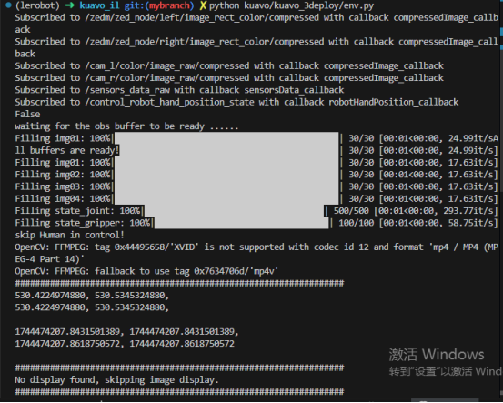
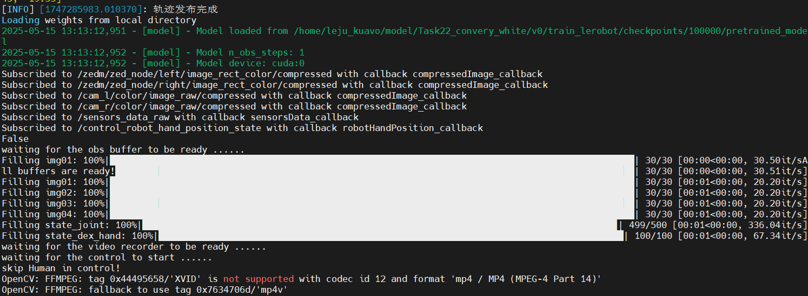
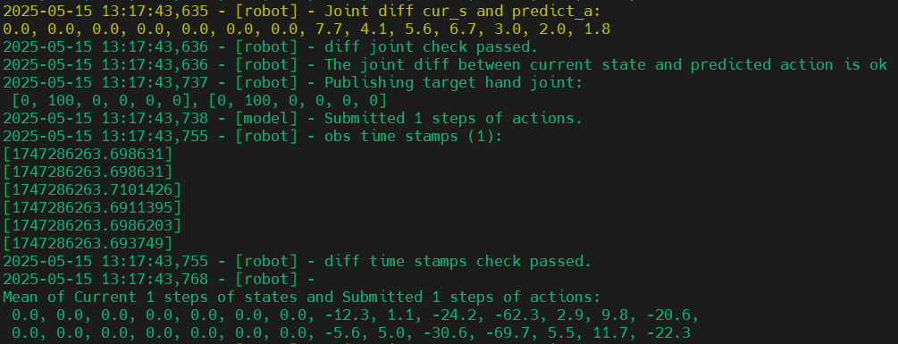
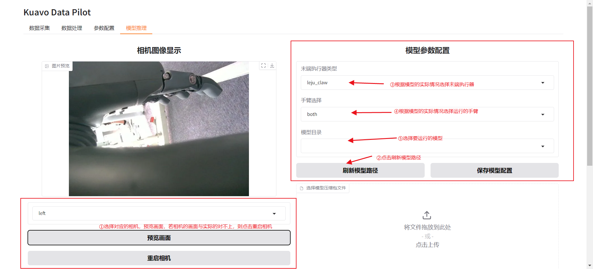
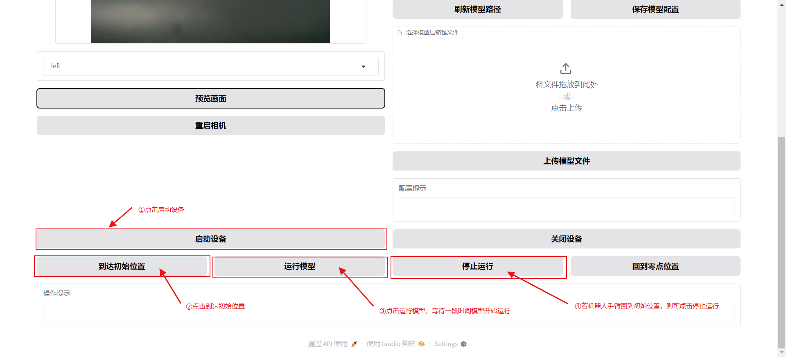

# 模型部署

::: tip 特别说明
通过[模型训练](../md-model-training-app/index.md)，在**训练机**得到了训练的40000轮的模型产物，路径为：`/home/lejurobot/mydisk/data/water-bottle-sorting/v0/train_leact/2025-04-29/10-28-17_act/checkpoints/040000/pretrained_model`。
:::
## 一、模型转移
### 1. 明确目标路径
机器人**上位机**上的数据存放的目标路径为：`/home/leju_kuavo/model/`，希望模型转移后构建的目录结构如下：
```txt
/home/leju_kuavo/model/water-bottle-sorting/
├── v0/train_leact/
│       └── 2025-04-29/10-28-17_act/checkpoints/
│           └── 040000/        ← 训练了40000轮的模型
│              ├── pretrained_model  ← 模型文件 
│              └── training_state
```
### 2. 进行转移
在机器人**训练机**执行以下命令：
```bash
rsync -av --info=PROGRESS /home/lejurobot/mydisk/data/water-bottle-sorting/v0/train_leact/2025-04-29/10-28-17_act/checkpoints/040000/ leju_kuavo@192.168.20.71:/home/leju_kuavo/model/water-bottle-sorting/v0/train_leact/2025-04-29/10-28-17_act/checkpoints/040000/
```

## 二、部署环境验证


训练后的模型需部署至支持**实时交互**的执行环境，该环境需满足以下两个关键条件：

**实时观测接口**

- **功能**：采集机器人多传感器数据（视觉、关节数据、IMU等），完成数据标准化处理。
- **要求**：确保数据与模型训练时的**观测维度**、**采样频率**（如10Hz）严格对齐，并保持多模态数据的时空一致性。

**动作执行接口**

- **功能**：将模型生成的动作序列，转换为机器人控制器（ROS话题）可执行的指令格式。
- **要求**：实现**低延迟指令下发**与**实时闭环反馈**，支持运动状态监控及异常中断机制。

### 操作说明

1.进入kuavo-il-opensource仓库

```bash
cd /home/leju_kuavo/kuavo-il-opensource
```

2.进行环境验证

```bash
python kuavo/kuavo_3deploy/env.py
```
3.正常收发数据则显示下图




​    
## 三、 部署测试

### 1. 机器人关节初始化

​1. 摆正，先短按D， 进行校准；(手动一下，腿伸直)

​2. 长按C+D 退出校准；

​3. 短按C缩腿；

​4. 下放牵引机，按C站立；

​5. 关闭时，尽量抬高一些牵引机。

### 2. 脚本部署


1.进入kuavo-il-opensource仓库

```bash
cd /home/leju_kuavo/kuavo-il-opensource
```

2.修改`kuavo/kuavo_3deploy/config/deploy_config.json`文件中ckpt模型路径以及其他配置。

|      参数      |           描述           |                            示例值                            |
| :------------: | :----------------------: | :----------------------------------------------------------: |
|   `arm_type`   |   指定的模型控制的手臂   |                          `"right"` `"both"` `"left"`                         |
| `gripper_type` | 末端执行器（夹爪）的类型 |                         `"dex_hand"` `"leju_claw"`                         |
|  `model_path`  |     预训练模型的路径     | `"/home/leju_kuavo/model/Task22_convery_white/v0/train_lerobot/checkpoints/100000/pretrained_model"` |


​4.修改后运行model_run.sh文件

```
./device_start.sh &
```

```
./kuavo/kuavo_3deploy/model_run.sh
```
显示下图，即为等待接受信息



5.机器人侧发送信号，出现下图则部署成功



### 3. GUI部署
1. 预览各个相机与实际的画面是否对上
2. 刷新模型路径；选择运行的模型对应的末端执行器；对应的运行的手臂；选择需要部署的模型

3. 点击"启动设备"初始化手臂的控制模式；点击"到达初始位置"初始化模型运行时的初始位置；点击"运行模型"等待一段时间开始模型的运行；

4. 若模型开始运行，则手臂会有明显的运动
## 四、env.py代码说明

`env.py`所在的路径为`~/kuavo-il-opensource/kuavo/kuavo_3deploy/env.py`，env.py主要提供类KuavoEnv，用于获取传感器观测数据（关节信息、传感器参数、图像信息）和控制机器人的关节运动。

### 1. KuavoEnv类关键函数说明
| **函数名**                                                   | **功能描述**                                                 | **输入参数**                                                 | **返回值/输出**                                              | **典型应用场景**                                             |
| ------------------------------------------------------------ | ------------------------------------------------------------ | ------------------------------------------------------------ | ------------------------------------------------------------ | ------------------------------------------------------------ |
| **`get_obs(just_img)`**                                      | 异步获取机器人观测数据（图像/低维状态），并基于时间戳对齐多传感器数据。 | `just_img`（布尔值）：若为`True`，仅返回图像数据；否则返回完整观测数据。 | 元组：`(obs_data, camera_obs, camera_obs_timestamps, robot_obs, robot_obs_timestamps)`<br/>- `obs_data`: 合并后的观测字典<br/>- `camera_obs`: 图像数据<br/>- `robot_obs`: 低维状态数据 | - 模型推理前获取标准化观测数据<br/>- 多传感器融合场景（如视觉+关节状态） |
| **`check_predict(actions, current_state)`**                  | 验证预测动作与当前状态的关节差值是否在安全范围内（通过日志记录，未强制断言）。 | `actions`（`np.ndarray`）：模型预测的动作序列<br/>`current_state`（`np.ndarray`）：当前机器人状态 | 布尔值：`True`（通过检查）或`False`（未通过，但代码中未实际返回`False`） | - 动作执行前的安全校验<br/>- 调试时监控关节运动合理性         |
| **`exec_actions(actions, current_state, which_arm, eef_type)`** | 执行动作指令，包括双臂/单臂控制、关节插值及末端执行器（EEF）控制。 | `actions`（`np.ndarray`）：待执行的动作序列<br/>`current_state`（可选）：当前状态<br/>`which_arm`（字符串）：指定操作手臂（`'left'`/`'right'`/`'both'`）<br/>`eef_type`（字符串）：末端执行器类型 | 无（通过日志输出执行状态）                                   | - 闭环控制中向机器人发送指令<br/>- 硬件在环（HITL）测试       |


## 五、eval.py代码说明

`eval.py`所在的路径为`~/kuavo-il-opensource/kuavo/kuavo_3deploy/eval.py`,读取配置文件，根据配置文件加载`lerobot`模型框架，实例化模型策略`policy`

### 1. 配置参数设置 {#eval-config}


```python
test_cfg = {
    'model_fr': 'oridp', # 'oridp' or 'lerobot'
    'policy': 'diffusion', # 'diffusion' or 'act'
    'task': 'Task17_cup_oridp',
    'ckpt': [
        '/home/leju_kuavo/hx/kuavo/Task17_cup/V_1/train_lerobot/outputs/train/2025-04-13/13-42-18_act/checkpoints/120000/pretrained_model', # leact, Task17_cup
        '/home/leju_kuavo/hx/kuavo/Task17_cup/V_1/train_lerobot/outputs/train/2025-04-13/13-42-18_act/checkpoints/020000/pretrained_model', # leact, Task17_cup
        #后面可能还有其他的参数...........................
            ],
    'debug': False,
    'is_just_img': False,
    'bag': '/home/leju-ali/hx/kuavo/Task12_zed_dualArm/rosbag/rosbag_2025-03-15-14-35-05.bag',
    'fps': 10,
    'which_arm': 'right',
}
```


  **参数说明**

| 参数名          | 类型    | 说明                                                         | 示例值/可选值                                      |
| --------------- | ------- | ------------------------------------------------------------ | -------------------------------------------------- |
| **model_fr**    | String  | 加载的模型框架的名称                                         | `'lerobot'`                                        |
| **policy**      | String  | 模型策略，决定模型的行为和如何生成动作序列                   | `'diffusion'` 或 `'act'`                           |
| **task**        | String  | 当前任务的名称（用于标识实验或任务）                         | `'task-test'`                                      |
| **ckpt**        | Arrary  | 模型检查点路径列表，支持记录多个预训练模型，但是只使用第一个 | `['/path/to/checkpoint1', '/path/to/checkpoint2']` |
| **debug**       | Boolean | 是否开启调试模式（可能影响日志输出、可视化等）               | `True` 或 `False`                                  |
| **is_just_img** | Boolean | 是否仅使用图像作为机器人观测数据（忽略其他传感器数据）       | `True` 或 `False`                                  |
| **which_arm**   | String  | 指定运行模型后哪只手可以动                                   | `'right'`（右臂）或 `'left'`（左臂）               |
| **fps**         | Integer | 帧率，用于判定数据时间戳对齐（1/fps 作为时间间隔阈值）       | `10`（表示时间戳间隔阈值为0.1秒）                  |
| **bag**         | String  | *（废弃）* 原始数据袋文件路径（如ROS bag文件）               | `'/path/to/rosbag_file.bag'`                       |

### 2. 加载预训练模型lerobot并且通过配置文件选择模型策略

```python
if POLICY == 'diffusion':
    policy = DiffusionPolicy.from_pretrained(Path(CKPT_PATH))
elif POLICY == 'act':
	policy = ACTPolicy.from_pretrained(Path(CKPT_PATH))
policy.eval()
policy.to(device)
policy.reset()
n_obs_steps = policy.config.n_obs_steps
drop_previous_action_num = 30
```

### 3. 初始化机器人环境(KuavoEnv)

```python
with KuavoEnv(
    frequency=FREQUENCY,
    n_obs_steps=n_obs_steps,
    video_capture_fps=30,
    robot_publish_rate=500,
    img_buffer_size=30,
    robot_state_buffer_size=100,
    video_capture_resolution=(640, 480),
    ) as env:
```

### 4. 进入预测控制循环，执行以下操作:

   - 获取多传感器观测数据


```python
     obs, camera_obs, camera_obs_timestamps, robot_obs, robot_obs_timestamps = env.get_obs(is_just_img)
```


   - 时间同步校验

```python
     time_stamp_array = []
     for k, v in camera_obs_timestamps.items():
         time_stamp_array.append([v[i] for i in range(n_obs_steps)])
     for k, v in robot_obs_timestamps.items():
         time_stamp_array.append([v[i] for i in range(n_obs_steps)])
     log_env.info(f"obs time stamps ({n_obs_steps}):\n" + "\n".join([f'{v}' for v in time_stamp_array]))
     time_stamp_array = np.array(time_stamp_array)
     
     tolerance = 1 / FREQUENCY
     env_info_diffs = np.abs(time_stamp_array[:, None, :] - time_stamp_array[None, :, :])
     triu_indices = np.triu_indices(env_info_diffs.shape[0], k=1)
     filtered_diffs = env_info_diffs[triu_indices]
     # log_env.info(f"同时刻不同obs之间的时间差约等于0:\n{env_info_diffs}")
     
     tolerance = 1 / FREQUENCY
     adjacent_obs_diffs = np.diff(time_stamp_array, axis=1)
     # log_env.info(f"同obs不同时刻之间的时间差约等于{1/FREQUENCY}: \n{adjacent_obs_diffs}")
```

   - 模型推理生成动作

```python
     with torch.inference_mode():
     	cur_time = time.time()
     	action = policy.select_action(observation)
```

   - 执行机器人动作

```python
env.exec_actions(
    actions=action[7:,:],
    current_state = obs['agent_pos'],
    which_arm = WHICH_ARM,
    eef_type= EEF_TYPE)
```