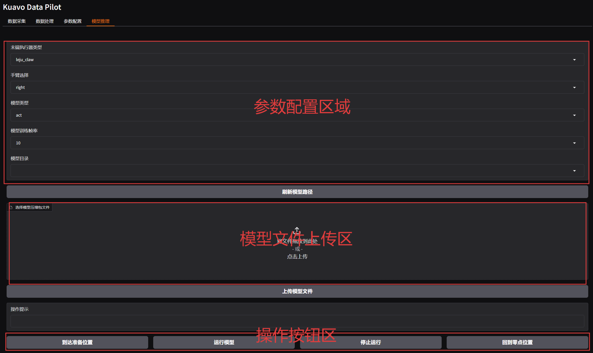
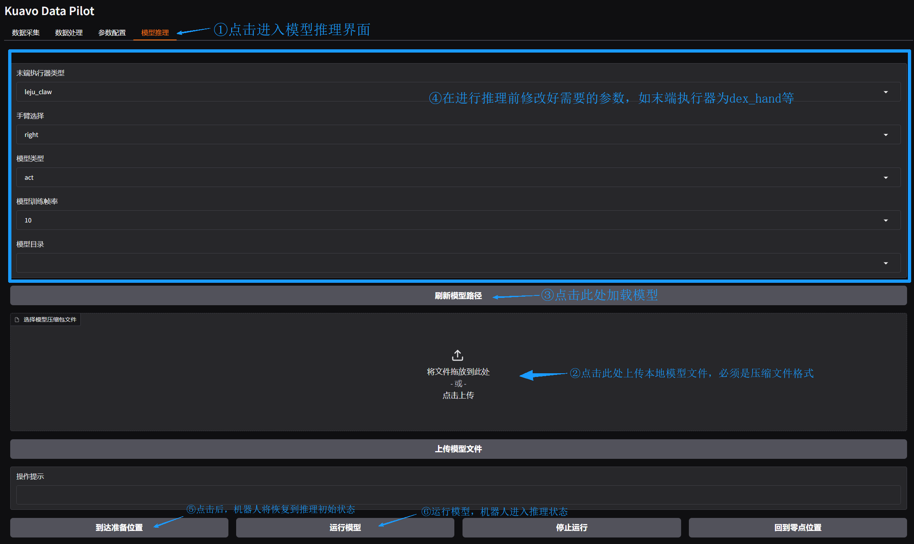

# 模型部署

通过[模型训练](../模型训练.md)，在**训练机**得到了训练的40000轮的模型产物，路径为：`/home/lejurobot/mydisk/data/water-bottle-sorting/v0/train_leact/2025-04-29/10-28-17_act/checkpoints/040000/pretrained_model`。

## 一、模型转移

### 1. 明确目标路径

机器人**上位机**上的数据存放的目标路径为：`/home/leju_kuavo/model/`，希望模型转移后构建的目录结构如下：

```txt
/home/leju_kuavo/model/water-bottle-sorting/
├── v0/train_leact/
│       └── 2025-04-29/10-28-17_act/checkpoints/
│           └── 040000/        ← 训练了40000轮的模型
│              ├── pretrained_model  ← 模型文件 
│              └── training_state
```

### 2. 进行转移

在机器人**训练机**执行以下命令：

```bash
rsync -av --info=PROGRESS /home/lejurobot/mydisk/data/water-bottle-sorting/v0/train_leact/2025-04-29/10-28-17_act/checkpoints/040000/ leju_kuavo@192.168.20.71:/home/leju_kuavo/model/water-bottle-sorting/v0/train_leact/2025-04-29/10-28-17_act/checkpoints/040000/
```

## 二、 部署测试

### 1. 机器人关节初始化

1. 摆正，先短按D， 进行校准；(手动一下，腿伸直)

2. 长按C+D 退出校准；

3. 短按C缩腿；

4. 下放牵引机，按C站立；

5. 关闭时，尽量抬高一些牵引机。

### 2. 界面说明

在 Kuavo Data Pilot 的“模型推理”TAB页，可以进行模型推理相关操作。界面主要分为以下几个部分：

- **参数配置区**：设置末端执行器类型、手臂选择、模型类型、模型训练帧频、模型目录等参数。
- **模型文件上传区**：选择并上传模型压缩包文件。
- **操作按钮区**：包括到达准备位置、运行模型、停止运行、回到零点位置等操作按钮。



### 3.操作步骤

1. **上传模型文件**
   - 在“选择模型压缩包文件”区域，将模型压缩包拖拽到指定位置，或点击上传按钮选择文件。
   - 上传完成后，点击“上传模型文件”按钮。

2. **参数配置**
   - 选择对应的末端执行器类型（如 dex_hand或leju_claw）。
   - 选择手臂（如 right，left或者双手Both）。
   - 选择模型类型（如 act）。
   - 设置模型训练帧频（默认为 10）。

3. **刷新模型路径**
   - 点击“刷新模型路径”按钮，确保模型目录已正确加载。

4. **推理操作**
   - 点击“到达准备位置”按钮，机器人将移动到推理准备位置。
   - 点击“运行模型”按钮，开始模型推理。
   - 推理过程中如需停止，点击“停止运行”按钮。
   - 推理结束后，点击“回到零点位置”按钮，机器人将手放下自动回到默认位置。



## 三、注意事项

- 模型文件必须为压缩包格式且上传模型压缩包的结构为**一个模型文件夹**和一个该模型需要的**准备动作bag包**。

  ```
  ├── model.zip/                    ← 模型压缩包
      ├── pretrained_model		  ← 模型文件夹
      └── start.bag                 ← 准备动作bag包
  ```

- 根据实际需求调整参数配置。

- 操作过程中请根据界面提示进行下一步操作。

- 末端执行器目前仅限于dex_hand
