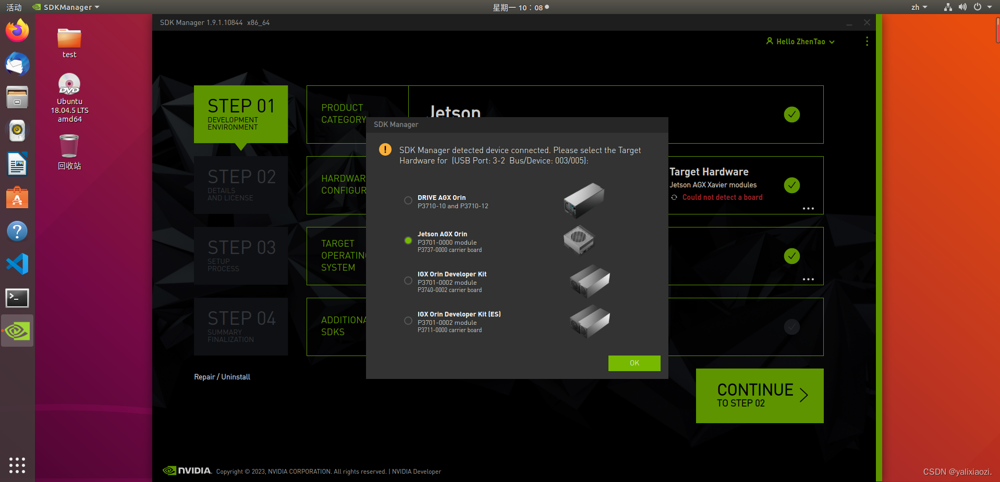
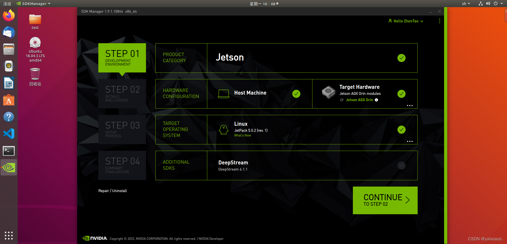
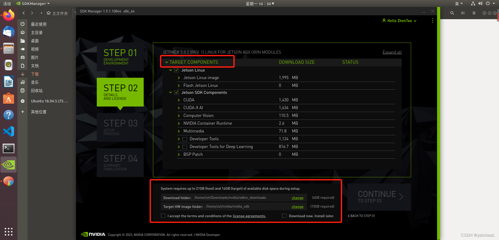
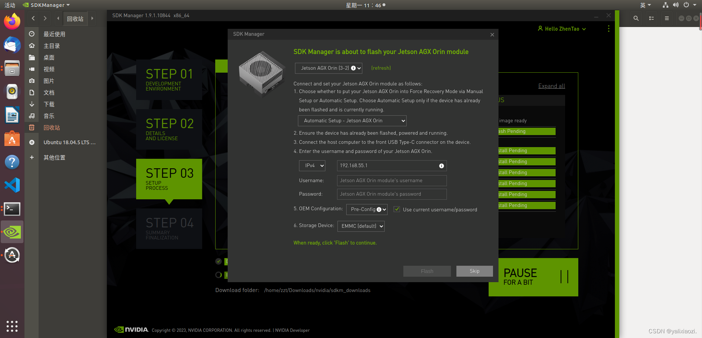
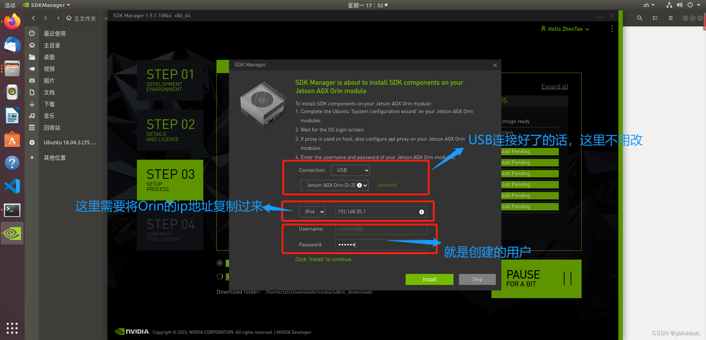
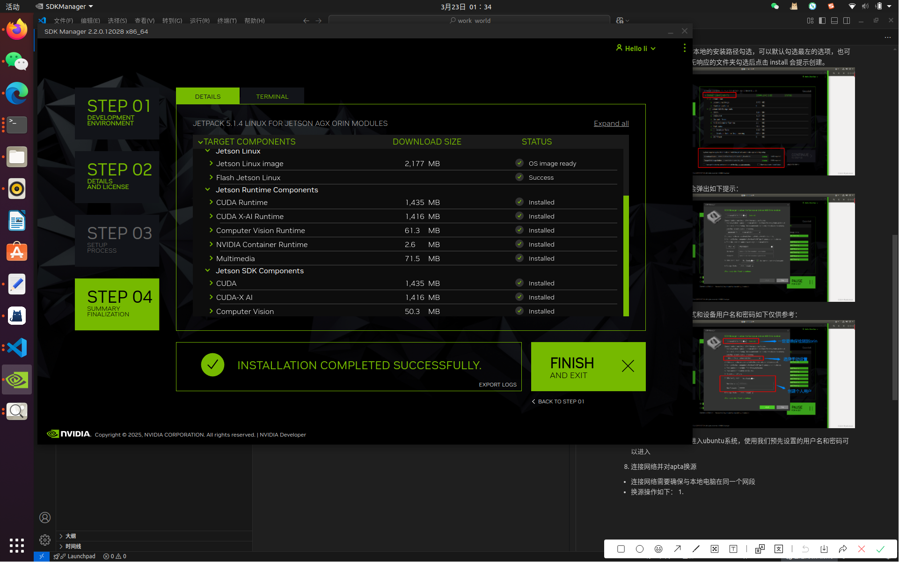
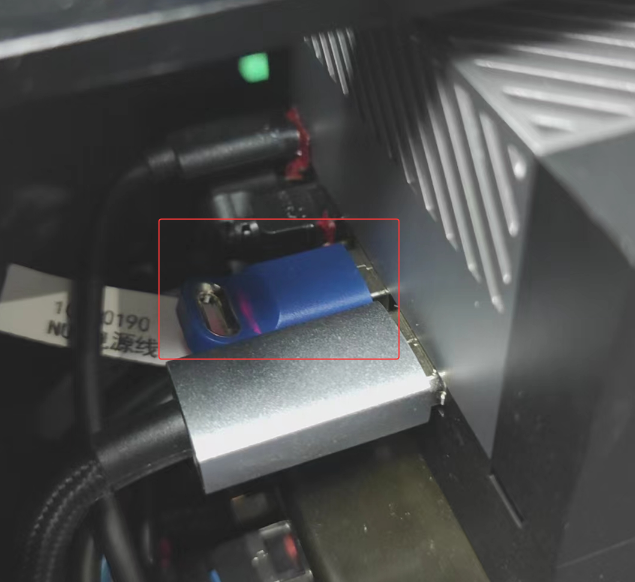

# 环境配置指南

::: tip 特别说明
针对kuavo设备，如需适配数据采集平台，需烧录对应的系统镜像。以下将详细介绍镜像烧录的操作流程。
:::

## 一、AGX-ORIN设备刷机指南
### 1. 烧录工具准备
1. **下载NVIDIA SDK Manager**
   - 访问[NVIDIA SDK Manager官方下载页面](https://developer.nvidia.com/sdk-manager)，下载适用于本地操作系统的安装包。

2. **安装SDK Manager**
   - 执行以下命令安装下载的`.deb`包：
     ```bash
     sudo dpkg -i <package_name>.deb
     ```

### 2. 烧录流程详解
1. **启动SDK Manager**
   - 使用注册的NVIDIA开发者账户登录SDK Manager，等待应用加载初始化数据。

2. **硬件连接准备**
   - **所需设备**：
     - 显示器（支持HDMI输入）
     - DP转HDMI数据线
     - 具备数据传输功能的USB Type-C线缆

3. **硬件连接操作**
   - 将显示器通过DP转HDMI线缆连接至AGX-ORIN设备
   - 使用USB Type-C线缆连接设备至主机PC（Type-C端连接设备烧录接口，需确保插口具有引脚标识）
   - 启动AGX-ORIN设备：
     1. 按住设备中间按钮
     2. 同时按下右侧按钮保持3-5秒
     3. 释放顺序：先松开右侧按钮，再松开中间按钮

4. **设备识别验证**
   - 在主机PC执行以下命令确认设备连接状态：
     ```bash
     lsusb
     ```
   - 预期输出应包含`NVIDIA Corp. APX`设备标识（示例：`Bus 003 Device 011: ID 0955:7023 NVIDIA Corp. APX`）



5. **系统镜像选择**
   - 在SDK Manager界面选择目标镜像版本



6. **安装路径配置**
   - 在`STEP 2`界面配置本地安装路径：
     - 可接受默认路径配置
     - 或自定义指定安装目录（若目录不存在，系统将提示创建）

 

7. **安装过程监控**
   - 等待系统组件安装完成

 

8. **设备初始化配置**
   - 设置设备参数（示例参数供参考）：
     - 安装模式：标准模式
     - 用户名/密码：自定义设置
   - 完成配置后设备将自动启动至Ubuntu系统

9. **网络配置与软件源替换**
   - **网络配置**：
     - 确保设备与主机PC处于同一局域网段
   - **软件源替换**：
     1. 编辑APT源配置文件：
        ```bash
        sudo vi /etc/apt/sources.list
        ```
     2. 替换为以下中科大镜像源（适配ARM64架构）：
        ```
        deb [arch=arm64] https://mirrors.ustc.edu.cn/ubuntu-ports/ focal main restricted universe multiverse
        deb [arch=arm64] https://mirrors.ustc.edu.cn/ubuntu-ports/ focal-updates main restricted universe multiverse
        deb [arch=arm64] https://mirrors.ustc.edu.cn/ubuntu-ports/ focal-backports main restricted universe multiverse
        deb [arch=arm64] https://mirrors.ustc.edu.cn/ubuntu-ports/ focal-security main restricted universe multiverse
        ```
     3. 更新软件包列表：
        ```bash
        sudo apt-get update
        ```

10. **SDK Manager后续配置**
    - 返回SDK Manager界面完成剩余配置
  


    - **注意事项**：
      - 烧录过程中需保持网络连接稳定
      - 若发生网络中断或模块下载失败，需从`STEP 2`重新开始
      - 完整烧录完成界面示例见下图



## 二、自定义镜像烧录指南
### 1. 使用Linux_for_Tegra工具包
1. **镜像文件准备**
   - 将目标镜像文件放置于本地PC
   - 确保镜像文件位于`Linux_for_Tegra/tools/backup_restore`目录下
   - 验证镜像文件夹名称为`images`（如不符需重命名）

2. **恢复模式烧录**
   - 将设备置于恢复模式
   - 执行以下烧录命令（需根据实际路径调整）：
     ```bash
     sudo ./tools/backup_restore/l4t_backup_restore.sh -r jetson-agx-orin-devkit
     ```

## 三、安全驱动模块安装
1. **硬件安装**
   - 关闭机器人电源
   - 拆卸机器人背部外壳
   - 将安全驱动模块插入指定接口
   - 重新组装机器人外壳

  