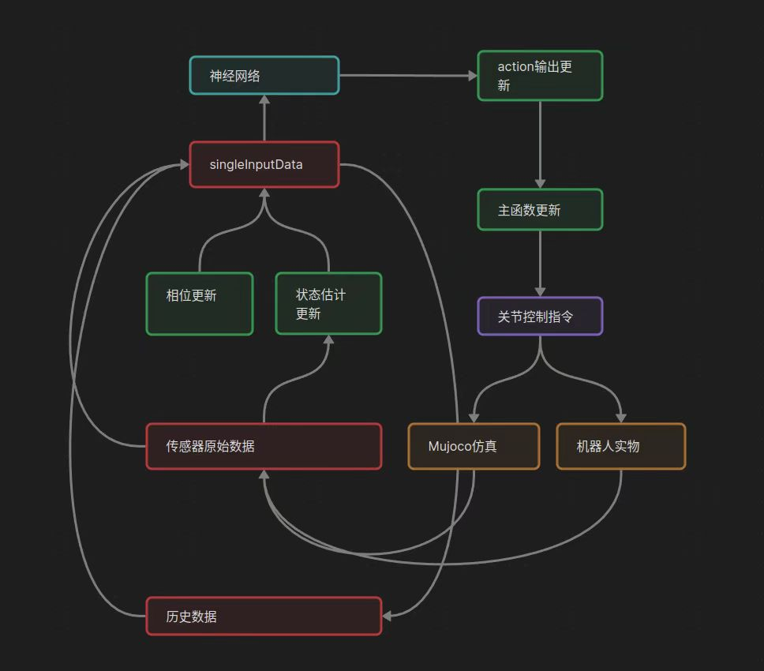

# 强化学习案例

- [强化学习案例](#强化学习案例)
  - [概述](#概述)
  - [部署](#部署)
    - [代码拉取和编译](#代码拉取和编译)
    - [参数修改](#参数修改)
    - [H12遥控器控制说明](#h12遥控器控制说明)
    - [程序启动及控制](#程序启动及控制)
    - [核心代码humanoidController说明](#核心代码humanoidcontroller说明)
      - [1. **初始化**](#1-初始化)
      - [2. **状态估计**](#2-状态估计)
      - [3. **控制模式切换**](#3-控制模式切换)
      - [4. **WBC 控制**](#4-wbc-控制)
      - [5. **RL 控制**](#5-rl-控制)
      - [6. **传感器数据处理**](#6-传感器数据处理)
      - [7. **关节命令发布**](#7-关节命令发布)
      - [8. **键盘控制**](#8-键盘控制)
      - [9. **状态机逻辑**](#9-状态机逻辑)
      - [10. **主要控制流程**](#10-主要控制流程)
      - [11. **关键数据结构**](#11-关键数据结构)
  - [训练](#训练)
    - [安装](#安装)
      - [isaacgym](#isaacgym)
      - [conda](#conda)
      - [配置环境](#配置环境)
    - [Training and Playing](#training-and-playing)
      - [示例](#示例)
      - [按照指定的pt文件继续训练](#按照指定的pt文件继续训练)
    - [参数说明](#参数说明)
      - [自定义参数详解](#自定义参数详解)
        - [1. 训练任务控制](#1-训练任务控制)
        - [2. 实验版本管理](#2-实验版本管理)
        - [3. 硬件资源配置](#3-硬件资源配置)
        - [4. 可视化与调试](#4-可视化与调试)
        - [5. 参数优先级逻辑](#5-参数优先级逻辑)


## 概述

> 本案例简单介绍如何使用乐聚开源的强化学习运动控制仓库kuavo-rl-opensource实现对乐聚夸父机器人的训练和部署。

- 实现逻辑框架如下图：



## 部署

### 代码拉取和编译
```bash
git clone -b beta https://gitee.com/leju-robot/kuavo-rl-opensource.git

cd kuavo-rl-opensource/kuavo-robot-deploy/
sudo su
source installed/setup.bash
catkin build humanoid_controllers
```
### 参数修改

修改 `kuavo-rl-opensource/kuavo-robot-deploy/src/kuavo_assets/config/kuavo_v42/kuavo.json`中的第40行：
```json
# "use_anthropomorphic_gait":false,
# 改为：
"use_anthropomorphic_gait":true,

```

### H12遥控器控制说明
- 遥控器按键说明如下：
   - 按钮功能说明：
      - `D`: STANCE 同时会上锁
      - `B`: INTO RL-Control
      - `A`: NONE
      - `C`: 解锁，解锁后可以进行踏步或者其他动作

   - 摇杆控制腿部运动
      - 左摇杆控制前后左右
      - 右摇杆控制左右转
   - `F`键实物控制时用于从悬挂准备阶段切换到站立
   - `E`键用于退出所有节点

- 启动说明
  - 实物启动 
    - 启动前确保`E`建在最左边，`F`建在最右边。
    - 机器人缩腿后`F`键拨到最左边是站立。
    - 在机器人站立后，依次按下对应进入强化学习模式和解锁的按键。此时可以通过摇杆控制机器人。
    - `E`键拨到最右边是停止程序（注意此时机器人不会自动下蹲）

### 程序启动及控制
```bash
#新开终端
cd kuavo-rl-opensource
sudo su
source devel/setup.bash
# 仿真
roslaunch humanoid_controllers load_kuavo_mujoco_sim.launch joystick_type:=h12 # 启动rl控制器、wbc、仿真器。
# 实物
roslaunch humanoid_controllers load_kuavo_real.launch joystick_type:=h12 # 可以选择cali:=true和cali_arm:=true进行校准启动，但校准启动不会自动缩腿，需要把F键拨到最左边两次，第一次是执行缩腿，第二次是执行站立 。
```
> 注意：仿真和实物选择一个启动即可。也可通过键盘控制，joystick_type参数指定为sim即可，终端有按键功能提示。

### 核心代码humanoidController说明

> 程序参阅: `<kuavo-rl-opensource>/src/humanoid-control/humanoid_controllers/src/humanoidController.cpp`
#### 1. **初始化**
在 `humanoidController::init` 函数中，控制器完成了以下初始化工作：
- **硬件接口初始化**：加载机器人硬件配置（如关节数量、电机参数等）。
- **OCS2 初始化**：加载任务文件、URDF 文件、参考文件等，初始化 OCS2（Optimal Control for Switched Systems）框架。
- **WBC 初始化**：初始化 `WeightedWbc` 和 `StandUpWbc`，加载任务设置。
- **状态估计器初始化**：初始化状态估计器（如卡尔曼滤波器）。
- **传感器数据缓冲区初始化**：创建传感器数据缓冲区，用于存储和处理传感器数据。
- **键盘控制线程**：启动键盘控制线程，用于接收用户输入。
- **推理线程**：启动推理线程，用于 RL 控制的神经网络推理。

---

#### 2. **状态估计**
在 `humanoidController::updateStateEstimation` 函数中，控制器通过传感器数据（如 IMU、关节位置、速度等）估计机器人的状态：
- **传感器数据处理**：从传感器数据缓冲区中获取最新的传感器数据。
- **状态更新**：使用卡尔曼滤波器或其他状态估计器更新机器人的状态（如基座姿态、关节位置、速度等）。
- **接触力估计**：估计脚部的接触力，用于 WBC 控制。
- **模式更新**：根据当前状态和接触力更新控制模式（如单脚支撑、双脚支撑等）。

---

#### 3. **控制模式切换**
控制器支持多种控制模式，包括：
- **WBC 控制模式**：使用 WBC 计算关节扭矩。
- **RL 控制模式**：使用强化学习模型生成控制命令。
- **站立控制模式**：使用 `StandUpWbc` 控制机器人从蹲姿到站姿的过渡。

控制模式的切换可以通过键盘输入或 ROS 服务调用来实现。

---

#### 4. **WBC 控制**
在 `humanoidController::update` 函数中，控制器调用 WBC 计算关节扭矩：
- **WBC 更新**：调用 `wbc_->update` 函数，根据当前状态、输入和模式计算关节扭矩。
- **关节命令生成**：将 WBC 计算出的扭矩转换为关节命令，发布到硬件接口。

---

#### 5. **RL 控制**
在 `humanoidController::inference_thread_func` 和 `humanoidController::updateRLcmd` 函数中，控制器使用强化学习模型生成控制命令：
- **神经网络推理**：在推理线程中，使用神经网络模型生成控制命令。
- **命令更新**：将神经网络输出的命令转换为关节扭矩或位置命令。
- **关节命令生成**：将 RL 控制命令发布到硬件接口。

---

#### 6. **传感器数据处理**
在 `humanoidController::sensorsDataCallback` 函数中，控制器处理传感器数据：
- **关节数据**：获取关节位置、速度、加速度和电流数据。
- **IMU 数据**：获取基座的姿态、角速度和线加速度数据。
- **数据滤波**：对传感器数据进行滤波处理，去除噪声。
- **数据存储**：将处理后的传感器数据存储到缓冲区中，供状态估计和控制使用。

---

#### 7. **关节命令发布**
在 `humanoidController::update` 函数中，控制器生成关节命令并发布到硬件接口：
- **关节命令生成**：根据 WBC 或 RL 控制的结果生成关节位置、速度和扭矩命令。
- **头部控制**：如果机器人有头部关节，生成头部关节的命令。
- **命令发布**：将关节命令发布到 ROS 话题 `/joint_cmd`，供硬件接口执行。

---

#### 8. **键盘控制**
在 `humanoidController::keyboard_thread_func` 函数中，控制器通过键盘输入实现控制：
- **用户输入**：接收用户输入的键盘命令（如 `w`、`s`、`a`、`d` 等）。
- **命令更新**：根据键盘命令更新控制参数（如速度、姿态等）。
- **模式切换**：通过键盘命令切换控制模式（如 WBC 模式、RL 模式等）。

---

#### 9. **状态机逻辑**
控制器的状态机逻辑如下：
1. **初始化**：加载配置、初始化硬件接口、WBC、状态估计器等。
2. **状态估计**：通过传感器数据估计机器人状态。
3. **控制模式选择**：根据当前状态和用户输入选择控制模式（WBC 或 RL）。
4. **控制计算**：调用 WBC 或 RL 模型生成控制命令。
5. **命令发布**：将控制命令发布到硬件接口。
6. **循环更新**：不断重复状态估计、控制计算和命令发布的过程。

---

#### 10. **主要控制流程**
1. **启动控制器**：
   - 初始化硬件接口、WBC、状态估计器等。
   - 启动键盘控制线程和推理线程。
2. **状态估计**：
   - 从传感器数据缓冲区获取最新的传感器数据。
   - 使用状态估计器更新机器人状态。
3. **控制模式选择**：
   - 根据当前状态和用户输入选择控制模式（WBC 或 RL）。
4. **控制计算**：
   - 如果选择 WBC 模式，调用 `wbc_->update` 计算关节扭矩。
   - 如果选择 RL 模式，调用神经网络模型生成控制命令。
5. **命令发布**：
   - 将控制命令发布到硬件接口。
6. **循环更新**：
   - 不断重复状态估计、控制计算和命令发布的过程。

---

#### 11. **关键数据结构**
- **SensorData**：存储传感器数据（如关节位置、速度、IMU 数据等）。
- **CommandData**：存储控制命令（如速度、姿态等）。
- **Observation**：存储机器人状态（如基座姿态、关节位置、速度等）。
- **JointCmd**：存储关节命令（如位置、速度、扭矩等）。


## 训练

### 安装
#### isaacgym
```bash
wget https://developer.nvidia.com/isaac-gym-preview-4
tar -xvzf isaac-gym-preview-4  #将名字改为 isaacgym 并存放在'kuavo-robot-train'同级目录下
```
#### conda
推荐使用MiniConda，轻量化使用更灵活。
```bash
#安装
mkdir -p ~/miniconda3
wget https://repo.anaconda.com/miniconda/Miniconda3-latest-Linux-x86_64.sh -O ~/miniconda3/miniconda.sh
bash ~/miniconda3/miniconda.sh -b -u -p ~/miniconda3
rm ~/miniconda3/miniconda.sh
#初始化
~/miniconda3/bin/conda init --all
source ~/.bashrc
```
#### 配置环境
```bash
conda create -n humanoid-gym-op python=3.8
conda activate humanoid-gym-op
cd kuavo-rl-opensource/kuavo-robot-train
pip install -e ../isaacgym/python
pip install -e .
```

### Training and Playing
#### 示例
```bash
python scripts/train.py --task=kuavo_s42_sk_ppo --run_name v1 --headless --num_envs 4096
python scripts/play.py --task=kuavo_s42_sk_ppo --run_name v1
```
#### 按照指定的pt文件继续训练
```bash
python scripts/train.py --task=kuavo_s42_sk_ppo --run_name v1 --headless --num_envs 4096 --resume --load_run Feb07_11-27-10_v1 --checkpoint 0 #该例子表示文件保存在'kuavo-robot-train/logs/Kuavo_s42_sk_ppo/Feb07_11-27-10_v1'目录下，选择了model_0.pt文件进行继续训练，headless选项关闭了GUI显示。
python scripts/play.py --task=kuavo_s42_sk_ppo --run_name v1 --load_run Feb07_11-27-10_v1 --checkpoint 0
```

### 参数说明
#### 自定义参数详解

##### 1. 训练任务控制
| 参数名 | 类型 | 默认值 | 关键作用 | 使用场景示例 |
|--------|------|--------|----------|--------------|
| `--task` | str | `XBotL_free` | 定义训练任务类型 | 切换机器人型号（如`XBotL_walking`）|
| `--max_iterations` | int | - | 最大训练迭代次数 | 限制训练时长 |
| `--resume` | flag | False | 从检查点恢复训练 | 训练意外中断后继续 |

##### 2. 实验版本管理
| 参数名 | 类型 | 关键作用 | 数据存储逻辑 |
|--------|------|----------|--------------|
| `--experiment_name` | str | 标识实验项目 | 对应 `experiments/` 下的文件夹 |
| `--run_name` | str | 单次运行标识 | 同一实验的不同参数对比 |
| `--load_run` | str | 加载历史运行记录 | `-1` 表示加载最新运行 |
| `--checkpoint` | int | 指定模型检查点 | `-1` 加载最新检查点 |

##### 3. 硬件资源配置
| 参数名 | 类型 | 默认值 | 技术细节 | 典型配置 |
|--------|------|--------|----------|----------|
| `--rl_device` | str | `cuda:0` | RL算法运行的设备 | `cuda:1` 指定第二块GPU |
| `--num_envs` | int | - | 并行环境数 | 4096（需根据显存调整）|
| `--horovod` | flag | False | 启用分布式训练 | 多GPU训练时使用 |

##### 4. 可视化与调试
| 参数名 | 类型 | 关键作用 | 典型使用场景 |
|--------|------|----------|--------------|
| `--headless` | flag | 禁用图形渲染 | 服务器无显示器环境 |
| `--seed` | int | 固定随机种子 | 实验可复现性保障 |

##### 5. 参数优先级逻辑
  - 命令行参数 > 配置文件 > 代码默认值