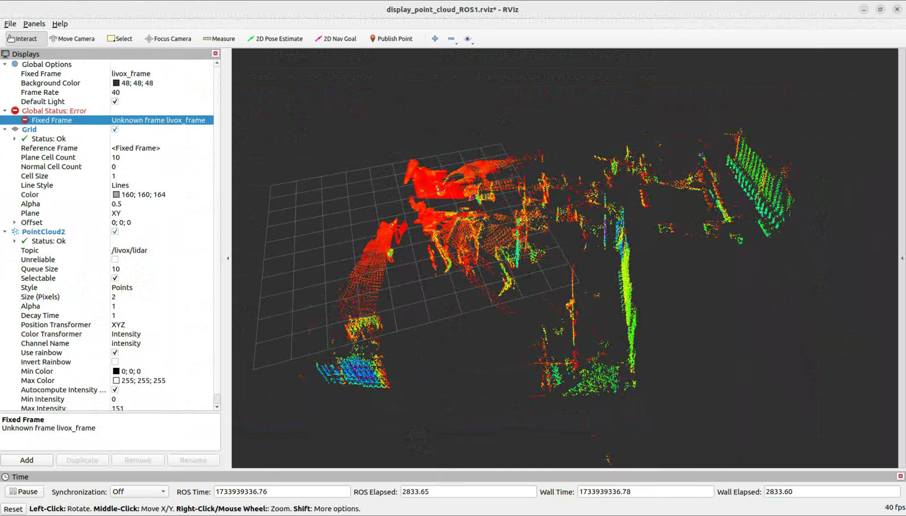
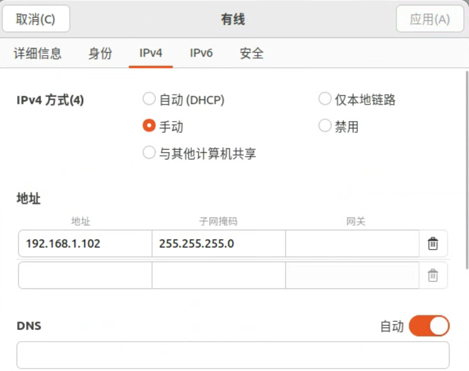
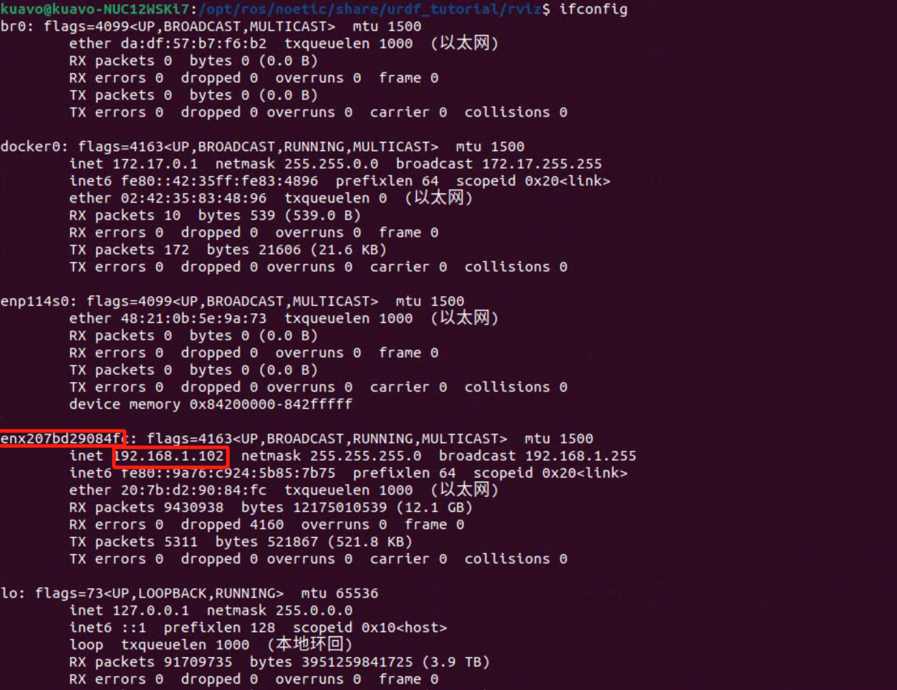

# 雷达基础使用

## 运行
```
source devel/setup.bash
roslaunch livox_ros_driver2 rviz_MID360.launch
```
雷达点云数据可视化


## 配置
- 雷达与nuc通过网口进行数据传输，需要配置固定ip以实现通讯
- 上位机固定ip: 192.168.1.102

- 雷达ip获取
  1. ifconfig找到连接雷达的网卡名

```sh
sudo apt install arp-scan
sudo arp-scan --interface=enx207bd29084fc 192.168.1.0/24 ##根据实际网卡名修改--interface=
```
输出结果示例
```sh
Interface: enx207bd29084fc, type: EN10MB, MAC: 20:7b:d2:90:84:fc, IPv4: 192.168.1.102
Starting arp-scan 1.9.7 with 256 hosts (https://github.com/royhills/arp-scan)
192.168.1.191	e4:7a:2c:b6:33:55	(Unknown)

35 packets received by filter, 0 packets dropped by kernel
Ending arp-scan 1.9.7: 256 hosts scanned in 1.910 seconds (134.03 hosts/sec). 1 responded
```
雷达ip为：192.168.1.191
- 修改雷达ip配置文件：`~/kuavo_ros_application/src/livox_ros_driver2/config/MID360_config.json`
- 示例文件
```json
{
  "lidar_summary_info" : {
    "lidar_type": 8
  },
  "MID360": {
    "lidar_net_info" : {
      "cmd_data_port": 56100,
      "push_msg_port": 56200,
      "point_data_port": 56300,
      "imu_data_port": 56400,
      "log_data_port": 56500
    },
    "host_net_info" : {
      "cmd_data_ip" : "192.168.1.102",
      "cmd_data_port": 56101,
      "push_msg_ip": "192.168.1.102",
      "push_msg_port": 56201,
      "point_data_ip": "192.168.1.102",
      "point_data_port": 56301,
      "imu_data_ip" : "192.168.1.102",
      "imu_data_port": 56401,
      "log_data_ip" : "",
      "log_data_port": 56501
    }
  },
  "lidar_configs" : [
    {
      "ip" : "192.168.1.191",
      "pcl_data_type" : 1,
      "pattern_mode" : 0,
      "extrinsic_parameter" : {
        "roll": 0.0,
        "pitch": 0.0,
        "yaw": 0.0,
        "x": 0,
        "y": 0,
        "z": 0
      }
    }
  ]
}
```
## 话题
- `/livox/imu`: 雷达内置imu信息
- `/livox/lidar`: 雷达点云数据信息