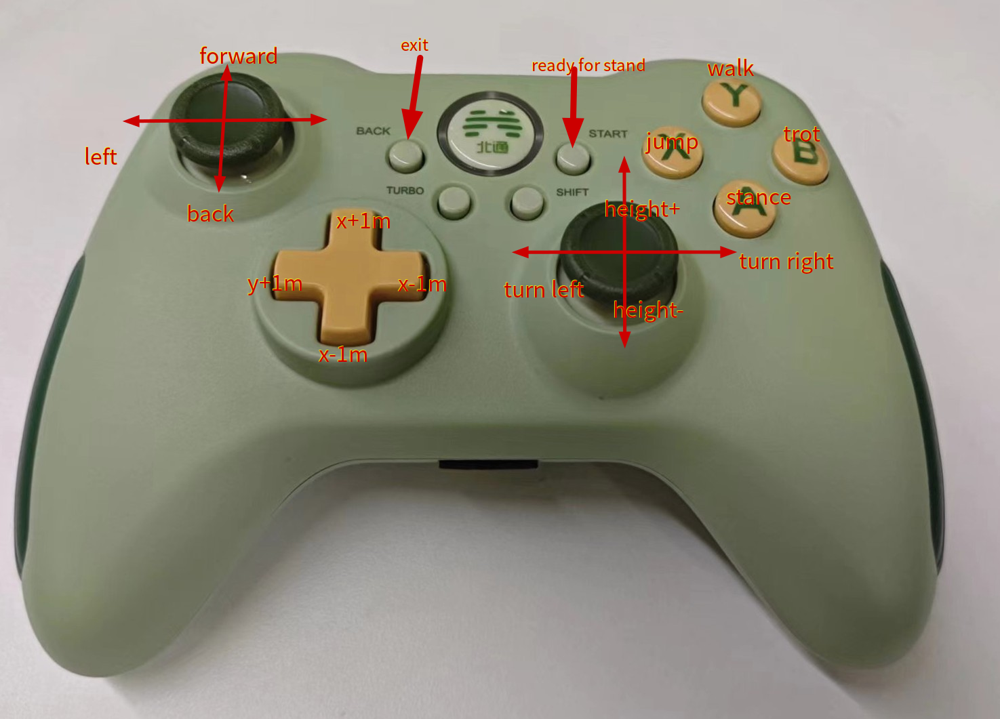
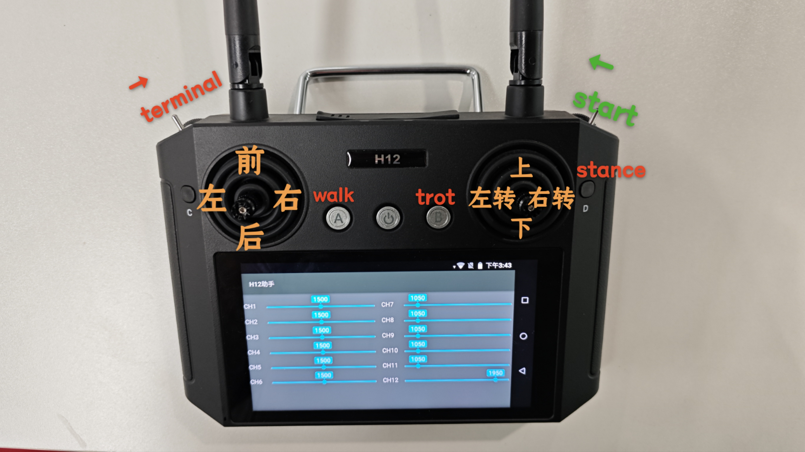

# 如何使用

## 克隆代码
```shell
# ssh
git clone ssh://git@www.lejuhub.com:10026/highlydynamic/kuavo-ros-control.git

# 或者https
git clone https://www.lejuhub.com/highlydynamic/kuavo-ros-control.git
```

## 开源仓库版本
```shell
# https
git clone https://www.lejuhub.com/highlydynamic/craic_code_repo.git

# ssh
git clone ssh://git@www.lejuhub.com:10026/highlydynamic/craic_code_repo.git
```

根据需要选择某个分支(一般稳定一些为dev)，然后更新子仓库
```shell
git checkout dev
git submodule update --init --recursive
```

## 编译

##### docker环境
> docker镜像自行根据后续章节使用`./docker/Dockerfile`构建

进入docker容器后，执行以下命令：
```bash
cd 
catkin config -DCMAKE_ASM_COMPILER=/usr/bin/as -DCMAKE_BUILD_TYPE=Release # Important! 
# -DCMAKE_ASM_COMPILER=/usr/bin/as 为配置了ccache必要操作，否则可能出现找不到编译器的情况
catkin build humanoid_controllers #编译，会编译所有依赖项
```
> Note:如果没有安装pinocchio，则需要先安装：
```bash
sudo apt install ros-noetic-pinocchio -y
```

## 开源版本编译

**IMPORTANT** 开源版本无法在 docker 容器内编译

```bash
sudo chmod +x <kuavo-ros-control>/ci_scripts/build.sh
./ci_scripts/build.sh

#注意事项，由于开源版本中编译时会依赖install目录下的文件，所以清除 catkin 工作区时，不能将install目录删除
#catkin clean -b -d -L -y #清除catkin工作区, 保留install目录
```
> 开源仓库仿真实物都使用这个脚本编译

##### 实机环境

kuavo实机镜像如果较旧，需要手动安装一些依赖项：
```bash
# 提供了一个脚本用于快速在旧的kuavo实机镜像进行安装依赖
./docker/install_env_in_kuavoimg.sh
```

- 实物编译
```bash
cd kuavo-ros-control #仓库目录
catkin config -DCMAKE_ASM_COMPILER=/usr/bin/as -DCMAKE_BUILD_TYPE=Release # Important! 
catkin build  humanoid_controllers
```

## 运行

## 确认机器人版本
- 机器人版本通过启动的launch文件中设置的rosparam`robot_version`确定
- 确认机器人的质量是否正确(出厂时的质量会修改正确)
   - 运行程序，终端输出中搜索mass，确认质量是否正确
   - pinocchio使用的urdf文件位于`src/humanoid-control/biped_s<robot_version>/urdf/`中
   - drake使用的urdf文件位于`src/humanoid-control/humanoid_interface_drake/models/biped_gen<robot_version>/urdf`中,修改`biped_v3_all_joint.xacro`和`biped_v3.xacro`两个文件中的质量，重新编译即可(编译会将urdf复制到`~/.config/Lejuconfig`目录)

```bash
source devel/setup.bash # 如果使用zsh，则使用source devel/setup.zsh
roslaunch humanoid_controllers load_normal_controller_mujoco_nodelet.launch # 启动控制器、mpc、wbc、仿真器
```
## 开源运行

```bash
source devel/setup.bash # 如果使用zsh，则使用source devel/setup.zsh
export LD_LIBRARY_PATH=/opt/ros/noetic/lib:/opt/ros/noetic/lib/x86_64-linux-gnu:${LD_LIBRARY_PATH}:/opt/drake/lib
export KUAVO_ROS_CONTROL_WS_INSTALL_PATH=<kuavo-ros-control>/install/ # 设置开源版本的install路径, 注意是绝对路径

roslaunch humanoid_controllers load_normal_controller_mujoco_nodelet.launch # 启动仿真器

roslaunch humanoid_controllers load_kuavo_real.launch # 启动实物节点
```


## 实物运行

- 实物运行需要hardware_node和状态估计模块，通过子仓库提供, 执行以下命令，克隆子仓库

```bash
git submodule update --init
```
- 编译

```bash
catkin build humanoid_controllers
```
- 运行
```bash
source devel/setup.bash
roslaunch humanoid_controllers load_kuavo_real.launch
```

## 手柄控制
> 遥控器型号通过运行时launch参数，joystick_type指定，在`src/humanoid-control/humanoid_controllers/launch/joy`目录指定了按键映射关系，新增遥控器类型可以直接添加自己的按键映射关系到json文件中，运行时通过`joystick_type:=bt2pro`传递相应文件名即可
- joystick_type:=bt2
   使用的手柄型号为"北通阿修罗2无线版"，参考的遥控器键位如下，其他型号需要自行修改遥控器节点：
   - 

   - 字母键切换gait
      - A: STANCE
      - B: TROT
      - X: JUMP
      - Y: WALK

   - 摇杆控制腿部运动
      - 左摇杆控制前后左右
      - 右摇杆控制左右转和上下蹲
   - 按钮发送固定target
   - start键实物控制时用于从悬挂准备阶段切换到站立
   - back键用于退出所有节点
- joystick_type:=h12
   使用的手柄型号为"H12pro"，参考的遥控器键位如下
   - 
   - 摇杆控制腿部运动
      - 左摇杆控制前后左右
      - 右摇杆控制左右转和上下蹲
   - 实物start开关掰到最中间位置可以结束悬挂准备阶段，进入站立状态
   - 左侧开关掰到最中间终止程序

`HumanoidAutoGaitJoyCommandNodeVel`节点(默认)
- 发送/cmd_vel消息给MPC
- 摇杆往前推，自动切换到walk行走，到达target之后自动停止
- 按钮发送固定target也会自动切换walk行走，自动停止
- 在stance状态时手动切换gait之后，会变成手动模式，通过摇杆可以控制运动，不会自动停止，直到重新切换回stance

`HumanoidJoyCommandNode`节点
- 没有自动切换gait的遥控器节点


> note: 手柄控制实物的`load_kuavo_real.launch`默认打开手柄控制，插上手柄接收器即可使用，仿真的launch文件，需要传入`use_joystick:=true`参数开启

## QUEST3 VR控制
- 按照前面的步骤正常启动机器人
  

- 启动VR节点
   - 运行
  
  > 旧版镜像如果没有包含VR相关依赖，需要手动安装：`cd src/manipulation_nodes/noitom_hi5_hand_udp_python && pip install -r requirements.txt && cd -`
  
  ```bash
   source devel/setup.bash

   # VR先和机器人连到同一局域网，查看VR里面的ip地址记下来
   # 然后在机器人上运行以下命令，ip_address输入quest3的ip地址，
   # ctrl_arm_idx输入控制的手臂编号0，1，2对应(左手，右手，双手)
   roslaunch noitom_hi5_hand_udp_python launch_quest3_ik.launch ip_address:=192.168.3.32 ctrl_arm_idx:=2
  ```
- 全程使用VR的手柄控制即可
  - 启动时按A键站立(从启动等待开始状态站立，相当于kuavo中的按o)；
  - 停止机器人，同时按下左侧XY两个键，停止机器人
  - 自动模式下，推摇杆即走，松摇杆自动立即停止
  - 按下A（stance）、B（walk）也可以手动切换gait
  - 扳机控制手指开合
  - 默认摇杆左摇杆控制前后，右摇杆控制左右转；
    - 当手放到一侧的两个按钮上时(只接触不按下)，切换为对侧为控制左右或者高度
    - 如手指覆盖住左侧的XY键，则右侧摇杆切换为高度控制
    - 手贴在左侧XY键，右侧摇杆会自然地变为高度控制，按下去即可关闭程序；
  - x键为模式切换辅助键，按住x键之后,其他按键的作用如下：
    - A:手臂模式切换为外部控制/自动摆手，这两种模式切换之后会有一个平滑同步到当前规划轨迹的过程
    - B:手臂模式切换为保持姿态
 

# 各个node和topic的介绍

[readme.topics.md](./docs/readme.topics.md)

# Build docker image&container for Kuavo-MPC-WBC
## 1. Install Docker
Follow the instructions on the official Docker website to install Docker on your system. 
## 2. Build docker imags with a dockerfile
We provide a dockerfile for Kuavo-MPC-WBC. You can use it to build a docker image for Kuavo-MPC-WBC. You just need to run the following command, which will build the docker image `kuavo_mpc_wbc_img:0.3` from the `./docker/Dockerfile`.
```bash
./docker/build.sh
``` 

# run docker container
## 1. Run docker container
You can run a docker container with the following command:
```bash
docker run -it --net host  --name kuavo_container  --privileged  -v /dev:/dev  -v "${HOME}/.ros:/root/.ros"  -v "./.ccache:/root/.ccache"  -v "./:/root/kuavo_ws"  -v "${HOME}/.config/lejuconfig:/root/.config/lejuconfig"  --group-add=dialout  --ulimit rtprio=99  --cap-add=sys_nice  -e DISPLAY=$DISPLAY  --volume="/tmp/.X11-unix:/tmp/.X11-unix:rw"  kuavo_mpc_wbc_img:0.3  bash
```

## 2. for GPU Version
If you want to use GPU version of Kuavo-MPC-WBC, you just need to add the `--gpus all` command to the `docker run` command.

## 3. we provide a script to run the docker container
You can run the docker container with the following command:
```bash
./docker/run.sh
```
> This script will automatically find the exisiting container and restart it, or create a new container if it does not exist, and run the container with the correct parameters. 


# Test
## 1. Mujoco simulator
By typing the following command, you can test if the mujoco is installed correctly. If successful, you will see a window pop up.
```bash
simulate
```
## 2. Kuavo with drake visualizer
First, make sure you have compiled kuavo (dynamic_biped). Then, start the drake visual interface:
```bash
drake-visualizer
```
Start the ROS version of the kuavo controller:
```bash
rosrun dynamic_biped highlyDynamicRobot_node
```
Pressing ‘r’ on the keyboard will enter the walking state, pressing ‘c’ will exit the walking state, for more usage please refer to the kuavo repository.
## 3. Ocs2 MPC
The follwing steps are based on the new dockerfile, if you are using the old one, please install the following dependencies in docker container. After that, you can start roslaunch normally.
```bash
apt-get update -y
apt-get install -y gnome-terminal \
dbus-x11 libcanberra-gtk-module libcanberra-gtk3-module
```

Start mujoco simulator and controller in a terminal:
```bash
roslaunch humanoid_controllers load_cheat_controller.launch
```
Once the above launch is complete (mainly because the compilation of CppAdInterface is time-consuming, you can set `recompileLibrariesCppAd` in `task.info` to `false` to avoid recompilation), press the spacebar on the mujoco page to start the simulation (mujoco simulation is paused by default). If you do not see the mujoco interface, you can enter `xhost +` in the terminal of the host (outside the docker container).

You can set the gait according to the prompts in terminals.

## use mujoco_cpp node
We provide a demo of using mujoco_cpp node (instead of the python one) to control the robot. 


```bash
roslaunch humanoid_controllers load_normal_controller_mujoco_nodelet.launch
```
